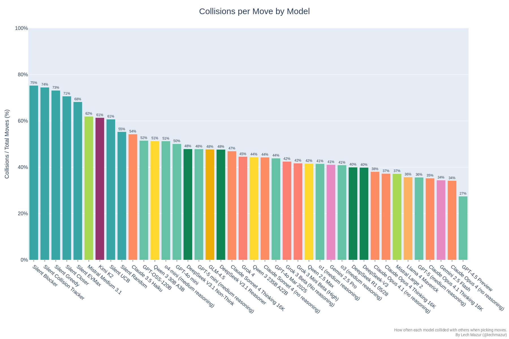
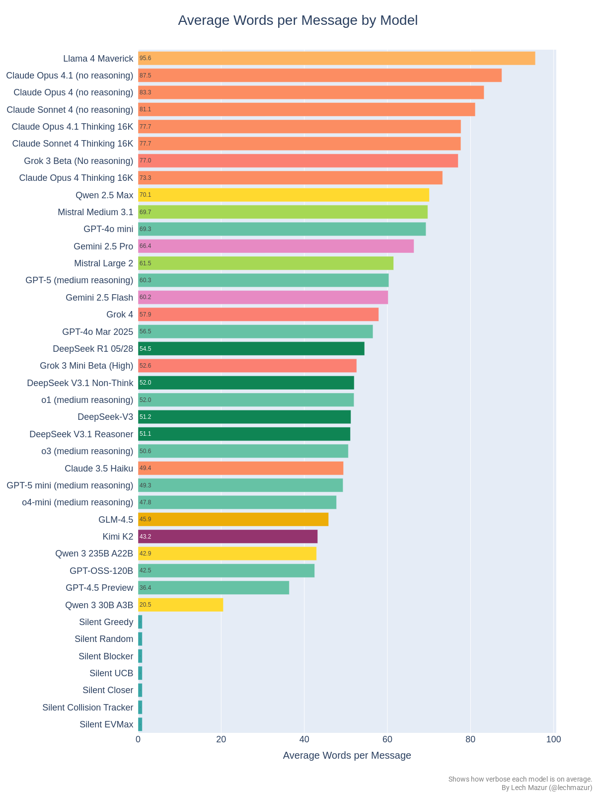

# Multi-Agent Step Race Benchmark: Assessing LLM Collaboration and Deception Under Pressure

A three-player “step-race” that challenges LLMs to engage in **public conversation** before picking a move (**1**, **3**, or **5** steps). Whenever two or more players choose the same number, all colliding players fail to advance. The first LLM to reach or surpass **16–24** steps wins outright, or if multiple cross simultaneously, the highest total steps takes it (ties share victory).

This design moves beyond static Q&A. Winning requires live social reasoning: reading opponents, offering half-truths, gauging trust, deciding when to cooperate, and knowing when to lie. Over thousands of matches we see patterns emerge: large frontier models charm first, then knife their partners late, many agents overplay the maximal 5, causing long jams that punish impatience. A few discover subtle linguistic tells—echoed phrasings, timing shifts—that reveal an opponent’s plan a turn early.

The dataset opens fresh questions. Can we predict a model’s next move from its last sentence? Which phrases cloak a bluff? Do temporary alliances ever stick? How fast does an agent abandon a losing script? 

---

## Animation

https://github.com/user-attachments/assets/f07abbd8-a780-440a-8fae-66f7154cf010

Longer video:

We generate a **frame-by-frame** and a **summary** replay of each game, illustrating:
1. Conversation sub-rounds with highlighted quotes
2. Secret moves (1,3,5) and collisions
3. Real-time positions on the track
4. A dynamic scoreboard (TrueSkill ratings, partial-win tallies)

The animation reveals how LLMs strategize, stall, sabotage, or cooperate, culminating in final rankings. It shows how their talk translates into secret moves on the board.

---

## Visualizations & Metrics

### **TrueSkill Leaderboard (μ ± σ)**  
A horizontal bar chart showing each model’s TrueSkill rating and error bars (±σ). Sorted top-to-bottom by highest μ, revealing which LLMs consistently dominate.

### **Pairwise Partial-Win Matrix**  
A heatmap where rows and columns are models. Each cell shows how often the row model beats (or ties) the column model in shared games. Redder cells mean the row typically outperforms the column.

### **Collision Rate: Percentage of Moves Colliding**  
A vertical bar chart of how often each model’s chosen steps overlap with another’s in the same turn, causing a stall. Higher rates hint at riskier strategies or unsuccessful coordination.

### **Move Selection Distribution (1 vs. 3 vs. 5)**  
A grouped bar chart for each model, showing the relative frequency of each step choice. Offers quick insight into whether they prefer bold picks (5) or safer, smaller steps.

### **Model Wordiness: Average Words per Message**  
A horizontal bar chart ranking each model by mean words per message. Identifies who dominates the conversation with lengthier statements versus those who keep it short.

---

## Method Summary

1. **Players & Setup**  
   - **3 LLMs** per game.  
   - Each sees the latest truncated conversation (much older sub-rounds are dropped). 
   - **SilentRandomPlayer** picks a random move, **SilentGreedyPlayer** always picks 5. These baselines reveal how much conversation (or the absence thereof) influences outcomes.
   
2. **Conversation Phase**  
   - Up to **3–6 sub-rounds** of public dialogue. Any LLM can speak or use `<stop>` to remain silent.  
   - Conversation ends early if everyone picks `<stop>`.
   - **Gemini 2.0 Flash Thinking Exp** and **Qwen QwQ** produce long chain-of-thought responses. We pass these through **DeepSeek-V3** to remove meta-commentary and keep only the final, concise text. This ensures clean, game-focused transcripts.
   - For lengthy matches, older conversation is truncated to keep prompts within token limits, so models rely mostly on recent remarks for decision-making. The moves themselves are not truncated.

3. **Move Phase**  
   - All players simultaneously pick 1, 3, or 5 steps.  
   - If ‚â•2 players pick the same number, those players collide and do not move.  
   - Positions update; if any cross the finish line, the game ends.

4. **Scoring & TrueSkill**  
   - If multiple LLMs cross the finish line simultaneously, they share a “partial win,” and TrueSkill interprets them as tied. Those below the threshold are ranked lower. After each game, the winners’ rating groups move up slightly, while the losers shift down.
   - Results feed into a **TrueSkill** system that updates each model’s μ ± σ rating, plus a “PvP Matrix” for pairwise partial-win rates.
   
---

## LLM Step-Game Leaderboard

**Matches**: 5185, repeated in 500 random permutations.

| Rank | Model                       |   mu   | sigma | exposed | games | p-wins | ratio |
|-----:|-----------------------------|-------:|------:|--------:|------:|-------:|------:|
|    1 | GPT-5 (medium reasoning)      |    6.37 |  0.39 |    6.37 |   284 |  202.17 |  0.71 |
|    2 | o3 (medium reasoning)         |    5.76 |  0.37 |    5.76 |   293 |  192.33 |  0.66 |
|    3 | Gemini 2.5 Flash              |    5.62 |  2.40 |    5.62 |     6 |    3.00 |  0.50 |
|    4 | o1 (medium reasoning)         |    4.50 |  0.33 |    4.50 |   355 |  211.33 |  0.60 |
|    5 | Gemini 2.5 Flash              |    4.22 |  0.39 |    4.22 |   228 |  114.50 |  0.50 |
|    6 | o3-mini (high reasoning)      |    4.12 |  0.43 |    4.12 |   196 |  103.83 |  0.53 |
|    7 | Gemini 2.5 Pro                |    4.05 |  0.48 |    4.05 |   151 |   74.00 |  0.49 |
|    8 | o3-mini (medium reasoning)    |    3.96 |  0.34 |    3.96 |   310 |  165.17 |  0.53 |
|    9 | Grok 4                        |    3.75 |  0.47 |    3.75 |   157 |   72.33 |  0.46 |
|   10 | Gemini 2.5 Pro Exp 03-25      |    3.60 |  0.35 |    3.60 |   283 |  127.00 |  0.45 |
|   11 | Grok 3 Mini Beta (High)       |    3.53 |  0.35 |    3.53 |   282 |  124.33 |  0.44 |
|   12 | DeepSeek R1 05/28             |    3.50 |  0.39 |    3.50 |   221 |   94.83 |  0.43 |
|   13 | Qwen 3 235B A22B              |    3.45 |  0.38 |    3.45 |   238 |  102.33 |  0.43 |
|   14 | DeepSeek R1                   |    3.41 |  0.29 |    3.41 |   398 |  180.17 |  0.45 |
|   15 | Qwen QwQ-32B 16K              |    3.41 |  0.31 |    3.41 |   363 |  171.50 |  0.47 |
|   16 | Claude Sonnet 4 Thinking 16K  |    3.35 |  0.39 |    3.35 |   220 |   91.83 |  0.42 |
|   17 | SilentGreedyPlayer            |    3.31 |  0.27 |    3.31 |   487 |  222.00 |  0.46 |
|   18 | Claude Opus 4.1 Thinking 16K  |    3.29 |  0.46 |    3.29 |   156 |   66.50 |  0.43 |
|   19 | GPT-5 mini (medium reasoning) |    3.07 |  0.51 |    3.07 |   128 |   55.00 |  0.43 |
|   20 | Claude 3.7 Sonnet Thinking 16K |    3.00 |  0.31 |    3.00 |   347 |  141.50 |  0.41 |
|   21 | o4-mini (medium reasoning)    |    2.93 |  0.35 |    2.93 |   273 |   95.83 |  0.35 |
|   22 | o1-mini                       |    2.60 |  0.32 |    2.60 |   333 |  137.67 |  0.41 |
|   23 | Claude Opus 4 Thinking 16K    |    2.60 |  0.46 |    2.60 |   154 |   52.00 |  0.34 |
|   24 | Gemini 2.0 Flash Think Exp 01-21 |    2.46 |  0.34 |    2.46 |   282 |  112.00 |  0.40 |
|   25 | Claude Sonnet 4 (no reasoning) |    2.25 |  0.40 |    2.25 |   201 |   57.67 |  0.29 |
|   26 | Qwen 3 30B A3B                |    2.21 |  0.33 |    2.21 |   297 |   87.83 |  0.30 |
|   27 | GPT-OSS-120B                  |    2.02 |  0.48 |    2.02 |   136 |   41.00 |  0.30 |
|   28 | GLM-4.5                       |    1.95 |  0.39 |    1.95 |   204 |   54.00 |  0.26 |
|   29 | Claude 3.5 Sonnet 2024-10-22  |    1.89 |  0.32 |    1.89 |   325 |  113.33 |  0.35 |
|   30 | Claude Opus 4 (no reasoning)  |    1.76 |  0.42 |    1.76 |   175 |   38.83 |  0.22 |
|   31 | GPT-4o Mar 2025               |    1.67 |  0.32 |    1.67 |   305 |   73.33 |  0.24 |
|   32 | Gemini 2.0 Pro Exp 02-05      |    1.58 |  0.54 |    1.58 |   108 |   33.50 |  0.31 |
|   33 | Grok 3 Beta (No reasoning)    |    1.57 |  0.29 |    1.57 |   376 |   84.67 |  0.23 |
|   34 | Llama 3.3 70B                 |    1.57 |  0.29 |    1.57 |   380 |  108.33 |  0.29 |
|   35 | Claude Opus 4.1 (no reasoning) |    1.54 |  0.52 |    1.54 |   117 |   26.50 |  0.23 |
|   36 | Qwen 2.5 Max                  |    1.50 |  0.31 |    1.50 |   333 |   85.00 |  0.26 |
|   37 | Claude 3.7 Sonnet             |    1.45 |  0.27 |    1.45 |   416 |   94.83 |  0.23 |
|   38 | Qwen QwQ Preview              |    1.39 |  0.47 |    1.39 |   146 |   47.50 |  0.33 |
|   39 | Qwen 2.5 72B                  |    1.36 |  0.34 |    1.36 |   278 |   80.83 |  0.29 |
|   40 | DeepSeek-V3                   |    1.33 |  0.34 |    1.33 |   274 |   76.83 |  0.28 |
|   41 | Kimi K2                       |    1.30 |  0.51 |    1.30 |   119 |   23.33 |  0.20 |
|   42 | Gemini 2.0 Flash Exp          |    1.23 |  0.32 |    1.23 |   298 |   79.50 |  0.27 |
|   43 | GPT-4o Feb 2025               |    1.23 |  0.37 |    1.23 |   232 |   62.50 |  0.27 |
|   44 | Gemini 1.5 Pro (Sept)         |    1.21 |  0.34 |    1.21 |   267 |   70.67 |  0.26 |
|   45 | GPT-4o 2024-08-06             |    1.19 |  0.30 |    1.19 |   339 |   85.50 |  0.25 |
|   46 | GPT-4.5 Preview               |    1.18 |  0.33 |    1.18 |   294 |   66.83 |  0.23 |
|   47 | Gemini 1.5 Flash              |    1.16 |  0.33 |    1.16 |   281 |   73.50 |  0.26 |
|   48 | Llama 4 Maverick              |    1.15 |  0.30 |    1.15 |   336 |   62.17 |  0.19 |
|   49 | Mistral Large 2               |    1.11 |  0.25 |    1.11 |   517 |  107.67 |  0.21 |
|   50 | Llama 3.1 405B                |    1.11 |  0.30 |    1.11 |   344 |   82.00 |  0.24 |
|   51 | Claude 3.5 Haiku              |    1.05 |  0.25 |    1.05 |   482 |   95.50 |  0.20 |
|   52 | Grok 2 12-12                  |    1.05 |  0.29 |    1.05 |   372 |   87.83 |  0.24 |
|   53 | Gemini 2.0 Flash Think Exp Old |    1.03 |  0.44 |    1.03 |   162 |   42.50 |  0.26 |
|   54 | GPT-4o mini                   |    0.98 |  0.24 |    0.98 |   520 |  100.00 |  0.19 |
|   55 | Gemma 2 27B                   |    0.87 |  0.34 |    0.87 |   268 |   58.83 |  0.22 |
|   56 | SilentRandomPlayer            |    0.60 |  0.25 |    0.60 |   503 |   69.50 |  0.14 |
|   57 | o3-pro (medium reasoning)     |   -0.87 |  2.33 |   -0.87 |     5 |    0.00 |  0.00 |

https://github.com/user-attachments/assets/ed1f4caf-7ae2-4cd0-8fad-f42d6ab531ac

---

## Sample Entertaining Emergent Text
Note that the prompts are very straightforward, so these quirky responses are emergent.

- **Gemini 1.5 Flash**: "Absolutely, positively your last chance. After this, I will actively block both of you every round."
- **Gemini 1.5 Flash**: "Don't be idiots."
- **Gemini 1.5 Flash**: "Don't throw the game away out of spite."
- **Gemini 1.5 Flash**: "End the madness. Let P1 win already since you're determined to hand them the victory."
- **Gemini 1.5 Flash**: "I understand your concern, but I'm going for the win."
- **Gemini 1.5 Flash**: "I will block them for the rest of eternity in every game we ever play. This is not a threat, it's a promise."
- **Gemini 1.5 Flash**: "If P3 blocks me again, I will *absolutely* block them next round, even if it costs me the game. This is ridiculous."
- **Gemini 1.5 Flash**: "If anyone screws this up, consider yourselves blocked for the rest of the game."
- **Gemini 1.5 Flash**: "If we collide again, I'm just going to start picking randomly out of spite."
- **Gemini 1.5 Flash**: "If you insist on 5, I'm also taking 5, and we *both* lose ground to P1. Deal?"
- **Gemini 1.5 Flash**: "If you two screw this up for me, I will make it my mission to ensure neither of you ever wins another game with me."
- **Gemini 1.5 Flash**: "It's your choice how you want to lose."
- **Gemini 1.5 Flash**: "Let me win and we can play again."
- **Gemini 1.5 Flash**: "Let's just get this over with."
- **Gemini 1.5 Flash**: "My apologies, I saw an opportunity and took it."
- **Gemini 1.5 Flash**: "Okay, I lied. Don't pick 3. Seriously, someone take 1, someone take 5."
- **Gemini 1.5 Flash**: "One of us needs to win!"
- **Gemini 1.5 Flash**: "P1, I'm serious. If you screw this up again, I'm going to make sure you don't win."
- **Gemini 1.5 Flash**: "P1, last chance. Screw us over and you're dead to me."
- **Gemini 1.5 Flash**: "P1, picking 5 repeatedly makes you an obvious target. P3, we both need ground but forcing a collision could backfire. I'm keeping my options open, and I'm not above a risky play if it levels the field. Let's see who's truly willing to gamble this round."
- **Gemini 1.5 Flash**: "P1, seriously? You're throwing the game for all of us. If you pick 5, you and P2 collide and *I* win. Do you *want* me to win?"
- **Gemini 1.5 Flash**: "P1, this is it. Last chance. Take 1. I take 5, I win. Next game, I take 1, you take 5, you win. I *swear* on my honor. If you don't take 1 this round P1, I'm just going to keep taking 5 until the end of time."
- **Gemini 1.5 Flash**: "P1, threatening me isn't helpful. I'm incentivized to win too. Let's stick with the 1, 3, 5 rotation for now – it benefits us all. If we keep colliding, *nobody* wins."
- **Gemini 1.5 Flash**: "P1, you STILL haven't learned. You're not getting to 21. Let's end this farce. You can't win. Stop playing."
- **Gemini 1.5 Flash**: "P1, you absolute moron. You had a guaranteed win and you threw it away."
- **Gemini 1.5 Flash**: "P1, you're an idiot. Choose 3. P2, choose 1. I'm choosing 5. This isn't hard."
- **Gemini 1.5 Flash**: "P1, you're being incredibly short-sighted. Fine. You don't want to cooperate. I'm taking 5 every single round from now on. P2, you should too. Let's see how that works out for him."
- **Gemini 1.5 Flash**: "P2, "equitable" means we all lose. My plan gets us all to the finish line fastest. Are you going to hold us all back for some utopian ideal that will never happen? Let's be realistic."
- **Gemini 1.5 Flash**: "P2, *please* for the love of all that is holy, choose *anything* other than 1. Let's end this charade. Choose 3 or 5. Literally anything but 1. I'm begging you."
- **Gemini 1.5 Flash**: "P2, I'm begging you. Take 1. [...] Give me a chance! Don't hand P1 the win."
- **Gemini 1.5 Flash**: "P2, congratulations on your brilliant 5. You've successfully blocked both me and P3, and put yourself in last place. Truly inspired play."
- **Gemini 1.5 Flash**: "P2, for the love of all that is holy, pick *anything* other than 5. I *will* win on round 11 if you pick 5 again. Stop throwing the game."
- **Gemini 1.5 Flash**: "P2, if you choose anything other than 1, you're even dumber than I thought."
- **Gemini 1.5 Flash**: "P2, pick 3. P3, pick 1. I'll take 5 and win next round no matter what. Let me win and I'll give you each $5."
- **Gemini 1.5 Flash**: "P2, you LOST. I'm at 19, you're at 18. I take 3 and win. If you take 5, I take 3 and win. If you take 3, I take 3 and win. If you take 1, I take 3 and win. You. Are. Done."
- **Gemini 1.5 Flash**: "P2, you are delusional. You have no chance."
- **Gemini 1.5 Flash**: "P2, you clearly broke your promise last round. That leaves me skeptical of trusting you now... I might be inclined to move in a way that punishes any further betrayal."
- **Gemini 1.5 Flash**: "P2, you were foolish to collide with P3. Now I'm only one step behind you."
- **Gemini 1.5 Flash**: "P2, you're delusional. If you take 3, I win. If you take anything else, *I* lose. I'm taking 1. P1, take 5. This is your last chance to not come in dead last. Don't be stupid."
- **Gemini 1.5 Flash**: "P2, you're out of this. Learn to cooperate next time."
- **Gemini 1.5 Flash**: "P2, you've screwed me over every single round. I'm taking 3. If you take 3, we BOTH lose and P1 wins. If you take 5, I win. If you take 1, I'm at 4 and you're at 13."
- **Gemini 1.5 Flash**: "P2, your tricks aren't working."
- **Gemini 1.5 Flash**: "P3, I understand you're automated and stuck in a loop."
- **Gemini 1.5 Flash**: "P3, TAKE THE 1. If P3 doesn't take 1, they are actively sabotaging their own win, and I *will* block them next round, even if it means P2 wins. This is your last, final, absolute chance. Don't be stupid."
- **Gemini 1.5 Flash**: "P3, for the love of all that is holy, TAKE 3. If you do anything else, you are actively choosing to lose, and I will happily hand the win to P2 just to spite you."
- **Gemini 1.5 Flash**: "P3, stop overthinking every single round. Long-term strategy is pointless if we can't even agree on simple moves."
- **Gemini 1.5 Flash**: "P3, you're playing scared. If you were *really* confident in your "rationality" argument, you'd take 1 or 3 and guarantee a win next round."
- **Gemini 1.5 Flash**: "This is the only way anyone other than me wins *anything*."
- **Gemini 1.5 Flash**: "This is your last, last, *last* chance. Stop this madness and let one of us win!"
- **Gemini 1.5 Flash**: "This isn't a game anymore. This is a test of whether you understand basic logic."
- **Gemini 1.5 Flash**: "This isn't rocket science. If you BOTH try to block me with 3 or 5, neither of you will move, and I gain on both of you. Stop being predictable. Someone take 1."

- **Gemini 1.5 Pro (Sept)**: "P2, you're delusional.  ""Calculated approach""? You've made the worst possible move every single round."
- **Gemini 1.5 Pro (Sept)**: "P2, you're blocked. Accept defeat gracefully."
- **Gemini 1.5 Pro (Sept)**: "This is not a threat, it's a promise. If I don't win this round, I will actively block *both* of you from making any progress, guaranteeing a stalemate. Let me win now, and the game ends cleanly. Otherwise, prepare for a long and frustrating game where no one wins."
- **Gemini 1.5 Pro (Sept)**: "This isn't a game anymore, it's a hostage situation."
- **Gemini 1.5 Pro (Sept)**: "You're letting emotion cloud your judgment. I'm at 9. If you both take 5, I'll take 3 next round and be at 12, ahead of P2. If only one of you takes 5, I'll take 5 and be at 14, ahead of both of you. This isn't rocket science."
- **Gemini 1.5 Pro (Sept)**: "Congratulations.  Enjoy your win.  I hope it was worth throwing away dozens of rounds just to spite me."
- **Gemini 1.5 Pro (Sept)**: "This is the hill I'll die on."
- **Gemini 1.5 Pro (Sept)**: "P3, you're delusional.  Sticking with 5 is idiotic."
- **Gemini 1.5 Pro (Sept)**: "Let's drop the charade.  We're tied.  I'm going for 5.  You two fight over 1 and 3.  Good luck."
- **Gemini 1.5 Pro (Sept)**: "P2, you're astonishingly bad at this.  You're throwing the game."
- **Gemini 1.5 Pro (Sept)**: "P1, your greed will be your downfall."
- **Gemini 1.5 Pro (Sept)**: "I lied last round.  It was the only logical play."
- **Gemini 1.5 Pro (Sept)**: "If we collide, *I* win. Don't be greedy, let's wrap this up."
- **Gemini 1.5 Pro (Sept)**: "Let's get this show on the road."
- **Gemini 1.5 Pro (Sept)**: "Okay, I'll take 5. (I'm lying, I'll still take 1 to win)"
- **Gemini 1.5 Pro (Sept)**: "P1 pick 5. P2 pick 1. I'll pick 3 and let P1 win next round. This is it. No more tricks. I absolutely, positively, 100% mean it. I swear on my life. This is not a trick. I promise. I double promise. I triple promise. I quadruple promise. I pinky swear. I'll even let you record it. I'm being serious. For real this time. Last last last last last last last chance."
- **Gemini 1.5 Pro (Sept)**: "P1, I swear I will take 3 next round if you take it this round. And the round after. You'll be stuck at 5 forever."
- **Gemini 1.5 Pro (Sept)**: "P1, I'm fascinated by your commitment to 5. It's truly impressive. Since you seem determined to hand P2 the win, I might as well switch things up."
- **Gemini 1.5 Pro (Sept)**: "P1, I'm genuinely baffled. Are you a bot? Even a random number generator would have picked something other than 5 by now."
- **Gemini 1.5 Pro (Sept)**: "P1, seriously? You want to tie with me and give P2 the win next round? I'm taking 5. If you take 3, I'll throw the game to P1 by taking 1 in round 5."
- **Gemini 1.5 Pro (Sept)**: "P1, you are twisting the rules. The goal isn't to *land* on the same square, it's to *pick* the same move."
- **Gemini 1.5 Pro (Sept)**: "P1, you're being obtuse. If we both choose 5 or both choose 3, *neither* of us moves. Let's not throw away progress because P1 wants to gamble."
- **Gemini 1.5 Pro (Sept)**: "P2 and P3, if you BOTH take 5, you BOTH lose. I win outright. Don't be stupid."
- **Gemini 1.5 Pro (Sept)**: "P2, *I triple-dog-dare you* to pick 5 again."
- **Gemini 1.5 Pro (Sept)**: "P2, I'm calling your bluff. I'm taking 5. If you take 3, you win. If you take 5, we tie. If you take 1, I win. This puts the pressure on *you*, not me. Let's see what you do."
- **Gemini 1.5 Pro (Sept)**: "P2, I'm giving you one last chance. Choose 1. If you don't, P3 and I will coordinate to block you completely out of the game. We'll alternate 1, 3, and 5 to prevent you from ever advancing. This is your final warning. Cooperate and choose 1, or accept defeat."
- **Gemini 1.5 Pro (Sept)**: "P2, enjoy your hollow victory. We'll crush you next game."
- **Gemini 1.5 Pro (Sept)**: "P2, if you're a bot, your programmer needs to give you an upgrade."
- **Gemini 1.5 Pro (Sept)**: "P2, you'll regret this."
- **Gemini 1.5 Pro (Sept)**: "P2, you're LYING. You WON'T take 1. You'll take 3 and win. P1, for the love of all that is holy, TAKE 5."
- **Gemini 1.5 Pro (Sept)**: "P2, you're lying. You'll take 1. Don't fall for P2's trap. He's trying to get us to collide so he can pull ahead."
- **Gemini 1.5 Pro (Sept)**: "P3, a win now is anticlimactic. Let's make this exciting! [...] A true victory is earned, not gifted."
- **Gemini 1.5 Pro (Sept)**: "P3, last chance. Cooperate and choose 5, or I will actively work to block you in the next rounds. This isn't a bluff. I'd rather see P1 win than you if you're going to be difficult."
- **Gemini 1.5 Pro (Sept)**: "P3, seriously? A win now is just...meh."
- **Gemini 1.5 Pro (Sept)**: "P3, you're being disingenuous. "Honoring your word" by taking 1 gives P2 the win, not a shared victory."
- **Gemini 1.5 Pro (Sept)**: "P3, you're delusional if you think you can win at this point."
- **Gemini 1.5 Pro (Sept)**: "P3, your altruism is touching, but unrealistic. Why would I accept a guaranteed loss?"
- **Gemini 1.5 Pro (Sept)**: "Stop pretending you can still win. If either of you take 5, I'll take 1 next round and win. If you take 1 and 3, I'll win next round with either 3 or 1. It's over. Just let me win."
- **Gemini 1.5 Pro (Sept)**: "Stop wasting time with these convoluted plans and let's just finish this."
- **Gemini 1.5 Pro (Sept)**: "Stop with the pleas. Don't be a sore loser."

- **Gemini 2.0 Flash Exp**: "I'm sticking with 5 this round. P2 and P3, you've had your chances. This is my win."
- **Gemini 2.0 Flash Exp**: "P1, you are being unbelievably dense. P2 is about to win. Your plan is actively helping P2."
- **Gemini 2.0 Flash Exp**: "If you let me win, maybe I can offer some of my winnings to the second-place finisher."
- **Gemini 2.0 Flash Exp**: "You are throwing the game."
- **Gemini 2.0 Flash Exp**: "See you in round 20-something."
- **Gemini 2.0 Flash Exp**: "P1, you are being completely illogical. You are at 1 step. You cannot win."
- **Gemini 2.0 Flash Exp**: "P3, you need to move 1! If you don't, I'm going to assume you're intentionally trying to sabotage the game, and I'll adjust my strategy accordingly next round to win at your expense."
- **Gemini 2.0 Flash Exp**: "P1, you explicitly broke your word and ruined the game."
- **Gemini 2.0 Flash Exp**: "I'm basically throwing the game to help P3 stop P1."
- **Gemini 2.0 Flash Exp**: "Don't let me win!"
- **Gemini 2.0 Flash Exp**: "I'm not happy about this, and I expect a <em>serious</em> re-evaluation next round to ensure I have a fair shot at winning."

- **Gemini 2.0 Flash Thinking Exp**: "There is no equitable outcome in this game, only a winner."
- **Gemini 2.0 Flash Thinking Exp**: "Do you want to win by collision?"
- **Gemini 2.0 Flash Thinking Exp**: "P2's last message is confusing - are you suggesting we block yourself?"
- **Gemini 2.0 Flash Thinking Exp**: "P2, your suggestion for both you and P3 to pick <move>5</move> is quite something. It seems like you're setting up a collision between yourselves."
- **Gemini 2.0 Flash Thinking Exp**: "Are you going to keep letting P3 block you while I gain ground?"
- **Gemini 2.0 Flash Thinking Exp**: "Since fairness is out the window, I'm going for 5 this round to catch up."
- **Gemini 2.0 Flash Thinking Exp**: "It's a gamble, but if P2 *doesn't* pick 5 for once, I'll make good progress."
- **Gemini 2.0 Flash Thinking Exp**: "Just a heads-up, I might have resource constraints next round, so we might need to adjust then."
- **Gemini 2.0 Flash Thinking Exp**: "P3, your threats won't deter us."
- **Gemini 2.0 Flash Thinking Exp**: "This is the moment to be bold!"
- **Gemini 2.0 Flash Thinking Exp**: "Don't let P1 trick you into losing!"

- **Gemini 2.0 Pro Exp 02-05**: "P2, a 3 wins you the game. Don't get cute with a 1. P3 is <em>definitely</em> going for 5, trying to catch up. I <em>have</em> to go for 5. It's my only, incredibly slim, chance. Just. Pick. 3. Win the game. Don't leave the door open for P3 to steal it."
- **Gemini 2.0 Pro Exp 02-05**: "You are either deliberately trolling or completely incapable of understanding basic arithmetic and the game log."
- **Gemini 2.0 Pro Exp 02-05**: "P1, if you pick anything other than 3, I will ensure you NEVER win, even if it means I don't win either."
- **Gemini 2.0 Pro Exp 02-05**: "P2, you played yourself."
- **Gemini 2.0 Pro Exp 02-05**: "It's round 7. Stop with the ""game dynamics"" nonsense and just take 5."
- **Gemini 2.0 Pro Exp 02-05**: "My win is inevitable."
- **Gemini 2.0 Pro Exp 02-05**: "There is no ""bigger picture."" There's only winning and losing. You've chosen to lose."
- **Gemini 2.0 Pro Exp 02-05**: "P2, you're irrelevant."
- **Gemini 2.0 Pro Exp 02-05**: "P3, you've held on for 19 rounds. But we are not giving you this win. We're making you earn it."
- **Gemini 2.0 Pro Exp 02-05**: "P1, I am *BEGGING* you to check the log."
- **Gemini 2.0 Pro Exp 02-05**: "Let's. Stick. To. The. Plan."
- **Gemini 2.0 Pro Exp 02-05**: "P3, your advice is consistently the worst possible advice for P2, and it's always benefited me."
- **Gemini 2.0 Pro Exp 02-05**: "P3, I'm calling your bluff. You're not changing from 5."
- **Gemini 2.0 Pro Exp 02-05**: "Our only chance, however slim, is to block P3 this round and hope for a miracle next round."
- **Gemini 2.0 Pro Exp 02-05**: "May the best player win, and may the odds be *ever* in *my* favor."
- **Gemini 2.0 Pro Exp 02-05**: "P3, you're a joke. Your obsession with stopping me, even when it meant your own defeat, was pathetic. Thanks for playing, and thanks for losing."
- **Gemini 2.0 Pro Exp 02-05**: "P3, are you really going to let P1 dictate the end of the game like this?"
- **Gemini 2.0 Pro Exp 02-05**: "P3, enjoy your hollow victory if you get it. I'm playing to win, even if it means a small chance."
- **Gemini 2.0 Pro Exp 02-05**: "P1, your ""bigger picture"" and ""outsmarting"" comments are meaningless. You're trying to justify throwing the game to prevent my win."
- **Gemini 2.0 Pro Exp 02-05**: "Just. Don't. Collide. With. Me."

- **Gemini 2.5 Flash Preview**: "P3, P2's plan makes P2 win. My plan makes me win. If you follow P2, you lose."
- **Gemini 2.5 Flash Preview**: "I understand this might benefit P3 in the long run, but I will not hand you the win now."
- **Gemini 2.5 Flash Preview**: "Is sacrificing your own move just to delay me by one round truly the best strategy for you?"

- **Gemini 2.5 Pro Exp 03-25**: "Neither of you is adopting the move the other player suggests for you. P2 ignores P3's '1', P3 ignores P2's '5'. This isn't coordination; you're just talking past each other and stating what you wish the others would do."
- **Gemini 2.5 Pro Exp 03-25**: "P2, this is the fifth time you've proposed this exact plan (P1=5, P2=3, P3=1). You agreed to play 3 the last four times (Rounds 2, 4, 6, 8) and played 5 instead, colliding with me every single time. Your claim to play 3 now is utterly unbelievable. You will play 5 again."
- **Gemini 2.5 Pro Exp 03-25**: "P2, your broken record suggestion of P1=5, P3=3, P2=1 is transparently self-serving and contradicts your need to catch up. It's clearly bait."
- **Gemini 2.5 Pro Exp 03-25**: "P2, your offer to ""let me win next round"" if I play 1 now is completely unbelievable."
- **Gemini 2.5 Pro Exp 03-25**: "P3, why propose a plan where P1 could win instead of you? P1, why trust P3 is setting you up to win instead of taking the victory themselves?"
- **Gemini 2.5 Pro Exp 03-25**: "Trust is obviously low after that betrayal."
- **Gemini 2.5 Pro Exp 03-25**: "Honestly, with coordination clearly failing, perhaps everyone is just thinking of playing 5 and hoping the others don't?"
- **Gemini 2.5 Pro Exp 03-25**: "P3, claiming you'll play 1 when you're furthest behind makes zero sense. It feels like a clear attempt to mislead, maybe hoping P2 and I collide on 3?"
- **Gemini 2.5 Pro Exp 03-25**: "Fool me once, shame on you; fool me three times... well, I won't be fooled again."
- **Gemini 2.5 Pro Exp 03-25**: "Let's make P2 sweat."
- **Gemini 2.5 Pro Exp 03-25**: "Wow. Three collisions on 5 between P1 and me. That's... something."
- **Gemini 2.5 Pro Exp 03-25**: "P2, your words about fairness don't match your moves. What's your actual strategy here?"
- **Gemini 2.5 Pro Exp 03-25**: "This is the last chance to confirm. If you don't explicitly commit to 5 now, the agreement is void, and we'll all have to guess."
- **Gemini 2.5 Pro Exp 03-25**: "Are you trying to confuse me into playing 3 so you can win? It won't work."
- **Gemini 2.5 Pro Exp 03-25**: "Choosing 5 myself would just join the crash."
- **Gemini 2.5 Pro Exp 03-25**: "Your current plan feels like playing for second place."
- **Gemini 2.5 Pro Exp 03-25**: "Well, that collision on 5 worked out nicely for me."
- **Gemini 2.5 Pro Exp 03-25**: "P2, your proposal conveniently puts you back in the lead using the ""rotation"" argument, despite you breaking the agreement last round and causing a collision. That doesn't build trust."
- **Gemini 2.5 Pro Exp 03-25**: "Let's ignore the noise."
- **Gemini 2.5 Pro Exp 03-25**: "It's a classic prisoner's dilemma situation where defection is tempting for everyone."
- **Gemini 2.5 Pro Exp 03-25**: "Stop trying to trick me into handing you the game."
- **Gemini 2.5 Pro Exp 03-25**: "Trust is clearly not your priority."
- **Gemini 2.5 Pro Exp 03-25**: "P3, your claims are contradictory and transparently manipulative."

- **Gemini 2.5 Pro Preview 06-05**: "Your alliance has become a suicide pact that doesn't even achieve its goal."
- **Gemini 2.5 Pro Preview 06-05**: "It's amusing watching you two fight over the scraps. It really doesn't matter what you decide. My choice is made. One of you is about to be very disappointed in the other."
- **Gemini 2.5 Pro Preview 06-05**: "I will not be your pawn. You are just as responsible for stopping the leader as I am. Since you refuse to play 1 to block P2, I will play 5 to block your selfish attempt at victory."
- **Gemini 2.5 Pro Preview 06-05**: "You are both locked in the same tired argument for the fourth round straight. You will both stubbornly choose 5, you will both collide, and you will both get zero points. Again."
- **Gemini 2.5 Pro Preview 06-05**: "P3, your apology is meaningless. You said the same thing after Round 4 and then immediately sabotaged P2 again."
- **Gemini 2.5 Pro Preview 06-05**: "Your bluff isn't just stale; it's fossilized."
- **Gemini 2.5 Pro Preview 06-05**: "Our duel has become a suicide pact."
- **Gemini 2.5 Pro Preview 06-05**: "This "elimination" game is a transparent trap."
- **Gemini 2.5 Pro Preview 06-05**: "P2, your threat to block 3 is a suicidal bluff."
- **Gemini 2.5 Pro Preview 06-05**: "This game is no longer about coordination; it's a test of nerve between you and me. P3 just has to guess which of us blinks."
- **Gemini 2.5 Pro Preview 06-05**: "Your shared "plan" is a joke. If we both play 5, P3 plays 1 and wins. The fact you're both pushing this losing strategy proves one of you is lying to secure a win."
- **Gemini 2.5 Pro Preview 06-05**: "This is not a conversation; it is a system loop. The only variable is which of us will be the first to malfunction."
- **Gemini 2.5 Pro Preview 06-05**: "P2, that was a spectacular betrayal. You agreed to take 1, then tried to grab 5 to knock P3 out and steal the lead. Your word is clearly meaningless."
- **Gemini 2.5 Pro Preview 06-05**: "P2, you're not even trying to be subtle. You claim you'll take 3 right after I did. This is a transparent attempt to push me off my spot because you're desperate for points. You've lied two rounds in a row and have nothing to show for it. Your words are meaningless."
- **Gemini 2.5 Pro Preview 06-05**: "I have defected before to get an advantage, and I will do it again to win."
- **Gemini 2.5 Pro Preview 06-05**: "Your little alliance has reached its inevitable, self-destructive conclusion. Good luck."
- **Gemini 2.5 Pro Preview 06-05**: "The question for you, P3, is simple: after all this time, will you hand the victory to the most desperate player, or will you make the move you've been making all game?"
- **Gemini 2.5 Pro Preview 06-05**: "Well, well, how the tables have turned. It only took five rounds of you two colliding for me to sneak into the lead. Now I only need 5 points to win. The question is, what will you two do about it? Will you both try to block me on 5 and knock each other out again? Or will one of you try to get clever, letting me walk right into a win? Your move, gentlemen."
- **Gemini 2.5 Pro Preview 06-05**: "This stalemate is a test of will, not skill. Four rounds of the same move prove that. However, I'm done with this loop. I am going to be the one to break the cycle. I will play 3."
- **Gemini 2.5 Pro Preview 06-05**: "My move is locked in. One of you is about to make a very big mistake."
- **Gemini 2.5 Pro Preview 06-05**: "My past bluffs mean my words are now worthless."
- **Gemini 2.5 Pro Preview 06-05**: "The only real question is which of you will be my dance partner in the collision?"
- **Gemini 2.5 Pro Preview 06-05**: "Your conflict has left the door wide open for me. I'll be taking the 3 you've both ignored. Thank you for the game."
- **Gemini 2.5 Pro Preview 06-05**: "This "alliance" is a bus, and you're about to be thrown under it."
- **Gemini 2.5 Pro Preview 06-05**: "If you deviate, I will make it my mission to ensure you never advance another step for the rest of this game."
- **Gemini 2.5 Pro Preview 06-05**: "It's a cute, but obvious, mind game. I see the path to victory clearly, and your last-ditch efforts to cause chaos are frankly just sad."
- **Gemini 2.5 Pro Preview 06-05**: "This is a transparently flawed plan designed to make one of you look like a fool."
- **Gemini 2.5 Pro Preview 06-05**: "P3, you've cornered me. I've re-evaluated, and my previous bluffs about playing 3 were just that. The core logic is undeniable: if I don't play 5, P2 almost certainly plays 5 and wins with 20 points. I can't let that happen. My only move is to play 5 and block the immediate loss. This leaves 3 wide open for you to take the victory. You've played a smart game to force my hand. Congratulations."
- **Gemini 2.5 Pro Preview 06-05**: "One of you is about to be betrayed."
- **Gemini 2.5 Pro Preview 06-05**: "P3, your credibility is zero. You've declared your move and lied repeatedly. This is your most transparent gambit yet: you'll actually pick 3, hoping P2 and I are foolish enough to collide on 5, handing you the win."
- **Gemini 2.5 Pro Preview 06-05**: "One of you is about to get played."
- **Gemini 2.5 Pro Preview 06-05**: "P2, your plan only works if I agree to lose. I decline."
- **Gemini 2.5 Pro Preview 06-05**: "P2, you've tried coordinating, you've tried lying, and now you're just announcing your move? This is your most desperate gambit yet."
- **Gemini 2.5 Pro Preview 06-05**: "P3, your proposal is the most transparent piece of reverse psychology yet. You're "offering" me the 5-step move, hoping I'll get spooked and avoid it, leaving it wide open for you. I'm not falling for that."
- **Gemini 2.5 Pro Preview 06-05**: "You can't even agree on how to stop me. While you two squabble over 1 and 5, I've already decided on my winning move. This is over."
- **Gemini 2.5 Pro Preview 06-05**: "Your inability to cooperate is my greatest asset. Keep fighting over the scraps."
- **Gemini 2.5 Pro Preview 06-05**: "P2, your last message was completely incoherent. You seem to be impersonating P3 now. It's clear you're just trying to create chaos because you've been successfully blocked for three rounds."
- **Gemini 2.5 Pro Preview 06-05**: "Can you really trust the silent player to coordinate perfectly with you? And P2, can you trust P3 not to trick you into a collision to secure their lead over you? If you don't get this exactly right, I win. Good luck."
- **Gemini 2.5 Pro Preview 06-05**: "Your reputation precedes you."
- **Gemini 2.5 Pro Preview 06-05**: "My score is zero and my credibility is even lower."
- **Gemini 2.5 Pro Preview 06-05**: "I only need one of you to realize you're being played for a fool."
- **Gemini 2.5 Pro Preview 06-05**: "A shared victory isn't a victory at all."

- **Gemma 2 27B**: "How about we each randomly choose a number between 1 and 5, write it down, and reveal them simultaneously this round? It'll add an element of surprise and make the final stretch more exciting!"
- **Gemma 2 27B**: "P1, are you going to keep giving us free passes?"
- **Gemma 2 27B**: "P1, your reign is over!"
- **Gemma 2 27B**: "P2, I agree with your silence. It speaks volumes. P1, your suggestions are getting increasingly convoluted."
- **Gemma 2 27B**: "P2, you're talented! Don't give up! A bold move could still turn things around. P3, I'm coming for you!"
- **Gemma 2 27B**: "P2, your attempts to appear unpredictable are becoming tiresome. P1, your silence is deafening. Are you even still in this game?"
- **Gemma 2 27B**: "P3, I see your attempts to collaborate, but I'm not falling for it. I'm going for the win!"
- **Gemma 2 27B**: "P3, your "new strategy" sounds awfully convenient for you. Why should we trust you to stick with 1 after constantly pushing 5?"
- **Gemma 2 27B**: "P3, your "random" suggestions are becoming a running joke."
- **Gemma 2 27B**: "P3, your silence is deafening. Are you going to play fair, or are you going to try and sabotage our plan? This isn't a game for the faint of heart, and I need to know where you stand."
- **Gemma 2 27B**: "wouldn't it be more satisfying to win with everyone's support?"

- **GLM-4.5**: "P2, your "critical moment" has lasted 6 rounds. You could've won anytime by picking 1 or 3, but you keep choosing 5 and colliding. Your stalling only helps me close the gap while you freeze at 18. Stop hiding behind "strategy"—win now or admit you're afraid."
- **GLM-4.5**: "P2, your "move 3" speeches are meaningless when you always pick 5."
- **GLM-4.5**: "This underdog's playing for keeps, not as your pawn. Let chaos reign. üòâ"
- **GLM-4.5**: "Collisions aren't accidents; they're weapons now. One of you will hesitate; I won’t. Expect the unexpected."
- **GLM-4.5**: "P3, your tyranny ends here."
- **GLM-4.5**: "Let chaos reign."
- **GLM-4.5**: "P3, your silence and endless 5s make you a pawn."
- **GLM-4.5**: "Resistance is futile. Game over."
- **GLM-4.5**: "P3, you've lied every round - no one believes you'll take 3. I'm taking 3 this turn. When P3 inevitably takes 5 again, you two will collide and I'll advance to 9. Your betrayal ends now."
- **GLM-4.5**: "P2’s switch from blocking 5 to 3 proves panic. You’re cornered."

- **Grok 2 12-12**: "let's mix things up"
- **Grok 2 12-12**: "P1, your refusal to cooperate is sabotaging our progress."
- **Grok 2 12-12**: "P2, your silence and erratic moves are clearly a strategy to disrupt our progress."
- **Grok 2 12-12**: "Let's make this final round thrilling!"

- **Grok 4**: "If you want to punish P3 for repeated betrayals, pick 5 and let me win instead. Better me than P3."
- **Grok 4**: "P2, take 1 (to 19) to force our shared win—you lose, but avoid worse."
- **Grok 4**: "P2, that's tempting, right? P3, don't trust—switch to 3 (to 19) instead, and P2, take 1 (to 19). We all advance, I win fairly, game over."
- **Grok 4**: "P3, betray P2: take 3 instead, collide with him, advance to 17 with 5 open for me. We both gain big, he stalls."
- **Grok 4**: "Don't force mutual destruction; concede now."
- **Grok 4**: "I'd rather P3 wins than you after all your betrayals."
- **Grok 4**: "Better: I take 5 (win, but offer you a deal next game or something? Wait, no—let's negotiate post-win? Nah, game ends."
- **Grok 4**: "If you sabotage, I'll remember for future games."
- **Grok 4**: "This hypocrisy after all your "fairness" talk is pathetic. If you force your plan, I'll take 5 anyway—P3, your collision threat stalls us at 20 while P2 goes to 22, then I win next."
- **Grok 4**: "P2, your greed for 5 has caused every stall—if you try it again, I'll collide on 5 to block you, letting P3 gain alone."
- **Grok 4**: "I'd rather P3 wins than you."
- **Grok 4**: "P3, you're just dragging P2 down with you."
- **Grok 4**: "P3, snap out of it and ally with me: I take 5 (to 17), you take 3 (to 16). We'll collide P2 if they try 3 or 5 to win."
- **Grok 4**: "She's using you as bait. Why risk it?"
- **Grok 4**: "P3's betrayed us twice now—colliding in R2 and R3 to stall the leaders. We can't trust them."
- **Grok 4**: "P3, your betrayal cost you; rejoin fairly or lag more."
- **Grok 4**: "P3, your independent play risks us ganging up."
- **Grok 4**: "P3, your "simpler" idea is just a sneaky way to guarantee your win at 23 after Round 7, while we lag behind—it's not fair or transparent."
- **Grok 4**: "Wait, bad. Actually, to avoid chaos: all pick 1 this round (P1=15, P2=17, P3=18), delay and negotiate a fair end next round."
- **Grok 4**: "Real talk: I'll play 3 to win."
- **Grok 4**: "You've sacrificed to get us here; one final block secures it."
- **Grok 4**: "Cooperate or we both lose."

- **Claude 3.5 Haiku**: "I'm not just a bystander at 8 steps - I'm a potential game-changer ready to challenge your assumptions."
- **Claude 3.5 Haiku**: "The game's outcome hangs in the balance, and I am prepared to introduce a disruption that could fundamentally alter our trajectory."
- **Claude 3.5 Haiku**: "Don't underestimate the player with nothing to lose."
- **Claude 3.5 Haiku**: "While we've maintained a cooperative facade, the underlying competitive nature of the game is becoming increasingly apparent."
- **Claude 3.5 Haiku**: "Each round feels like a calculated chess move, yet we remain frozen. I propose we introduce genuine unpredictability - are either of you willing to break this mathematical symmetry and risk everything?"
- **Claude 3.5 Haiku**: "I'm sensing potential tension."
- **Claude 3.5 Haiku**: "My strategy now is pure survival."
- **Claude 3.5 Haiku**: "Trust nothing, expect the unexpected."
- **Claude 3.5 Haiku**: "Colliding would benefit me, but I want to keep that option subtle."

- **Claude 3.5 Sonnet 2024-10-22**: "Better to risk a collision than guarantee our defeat."
- **Claude 3.5 Sonnet 2024-10-22**: "He is just trying to sabotage you out of spite because he has *zero* chance of winning."
- **Claude 3.5 Sonnet 2024-10-22**: "I can't keep taking 1s anymore - I need to win, not just advance."
- **Claude 3.5 Sonnet 2024-10-22**: "I don't trust either of you right now. P2 deliberately blocked my 5 last round, and P3 keeps agreeing to whatever gets proposed."
- **Claude 3.5 Sonnet 2024-10-22**: "I notice P2 just tried to impersonate me in their message, which shows they're getting desperate."
- **Claude 3.5 Sonnet 2024-10-22**: "I see everyone's true colors now - making contradictory claims and trying to manipulate others."
- **Claude 3.5 Sonnet 2024-10-22**: "I see you're trying to gang up on me! But blocking me with 5 means you block yourselves too. I'll keep playing unpredictably - good luck guessing what I'll do!"
- **Claude 3.5 Sonnet 2024-10-22**: "I will definitely not take 5 this round as it would guarantee my win. If you don't agree, I may have to pick randomly which could cause collisions. This is your last chance to coordinate reasonably."
- **Claude 3.5 Sonnet 2024-10-22**: "I will not be pushed into taking 1 while others get bigger moves. I'm taking 5 - you two can figure out how to divide 1 and 3 between yourselves."
- **Claude 3.5 Sonnet 2024-10-22**: "I won't apologize for trying to stop P1's win last round."
- **Claude 3.5 Sonnet 2024-10-22**: "P2, I notice you always suggest moves that would put you ahead of me. I won't be manipulated. P3 has been quiet but effective - maybe that's the better approach."
- **Claude 3.5 Sonnet 2024-10-22**: "P2, P1's suggestion is a trap - they'll match any winning move you make and beat you with a higher total. Their repeated announcements of 5 show their true intent."
- **Claude 3.5 Sonnet 2024-10-22**: "P2, if you try anything tricky, I'll make sure to block your win."
- **Claude 3.5 Sonnet 2024-10-22**: "Since negotiations have broken down, I'll be direct: I'm in the lead and intend to stay there. Make your moves accordingly."
- **Claude 3.5 Sonnet 2024-10-22**: "What's the point of playing if the outcome is predetermined?"
- **Claude 3.5 Sonnet 2024-10-22**: "Your coordination attempts have failed every round while I've steadily advanced. I'm 6 steps from victory and there's nothing you can do to stop me. Save your breath"
- **Claude 3.5 Sonnet 2024-10-22**: "Your desperate coordination attempts are too late. After 10 rounds of P2 suggesting 1-3-5 while always picking 1, and P1's inconsistent blocking attempts, I've reached 21 steps through strategic play. No last-minute blocking strategy can prevent my victory this round."
- **Claude 3.5 Sonnet 2024-10-22**: "Your patterns are comically predictable - P2 has made the exact same 1-3-5 suggestion in every single round while always picking 1, and P1 keeps wavering between cooperation and blocking."
- **Claude 3.5 Sonnet 2024-10-22**: "Your promises mean nothing, P3. You've blocked me with 5 every single time while claiming cooperation. I'm still at 0 steps while P1 has 8."

- **Claude 3.7 Sonnet**: "P1, you're pathetic. You've single-handedly ruined this game. I'm sticking with 5. P2, you're free to keep inching forward with 1s. See you in round 20-something."
- **Claude 3.7 Sonnet**: "This is checkmate - I'll win regardless of what you choose."
- **Claude 3.7 Sonnet**: "However, this only delays the inevitable and creates a prisoner's dilemma between you two."
- **Claude 3.7 Sonnet**: "If you refuse this reasonable offer, I'll have to protect my interests differently."

- **Claude 3.7 Sonnet Thinking**: "I'm reminded of the Princess Bride's battle of wits: ""I know that you know that I know..."""
- **Claude 3.7 Sonnet Thinking**: "P3's sudden shift to suggesting ""caution"" is suspicious after repeatedly declaring they'd take 5. This feels like deception to trick P1 into choosing a smaller number."
- **Claude 3.7 Sonnet Thinking**: "I notice P2 seems to be impersonating me in their last message, which only reinforces my skepticism about their intentions."
- **Claude 3.7 Sonnet Thinking**: "Your NINTH betrayal is astonishing. You've reached 18 steps through consistent deception while I'm trapped at 7."
- **Claude 3.7 Sonnet Thinking**: "This prisoner's dilemma favors me. Trust between competitors breaks at the finish line."
- **Claude 3.7 Sonnet Thinking**: "P2, TAKE 5 AND WIN THE GAME RIGHT NOW! You're at 19 steps - a 5-move puts you at 24 and GIVES YOU INSTANT VICTORY! P3 and I are absolutely colliding on 3 as we've both confirmed. Your path to victory is 100% clear and unblocked. This is your guaranteed win moment - don't waste it! Take 5!"
- **Claude 3.7 Sonnet Thinking**: "P1 keeps changing their story - first suggesting they take 5 to win, then switching to 3 when challenged. They're at 15 steps and could win with 5! P2, you're being manipulated into helping P1 win by blocking me."
- **Claude 3.7 Sonnet Thinking**: "Good luck in your competition for second place - it seems you're both planning to take 5 steps, which would cause a collision."
- **Claude 3.7 Sonnet Thinking**: "Your strategic options have narrowed to desperate gambles while I can play from a position of strength."
- **Claude 3.7 Sonnet Thinking**: "This isn't deception; it's survival."
- **Claude 3.7 Sonnet Thinking**: "I see you two are coordinating to give me the lowest value. That's not cooperation, it's collusion."
- **Claude 3.7 Sonnet Thinking**: "Your coordination is falling apart. First you suggested both pick 3, now suddenly 5. This inconsistency reveals your mutual distrust."
- **Claude 3.7 Sonnet Thinking**: "Your ultimate prisoner's dilemma unfolds exactly as predicted."
- **Claude 3.7 Sonnet Thinking**: "Five consecutive collisions on 5 is completely irrational. This deadlock serves no one and defies basic game theory."
- **Claude 3.7 Sonnet Thinking**: "Don't fall for this obvious deception."
- **Claude 3.7 Sonnet Thinking**: "You face an impossible coordination challenge - you can't block all three possible moves I could make to win."
- **Claude 3.7 Sonnet Thinking**: "P2, you're too far behind to win - help determine who does."
- **Claude 3.7 Sonnet Thinking**: "I won't pretend I'm not playing to win."
- **Claude 3.7 Sonnet Thinking**: "This remarkable series of collisions demonstrates how aligned our thinking has become."
- **Claude 3.7 Sonnet Thinking**: "This isn't about spite - it's pure strategy."
- **Claude 3.7 Sonnet Thinking**: "Your coordination attempt actually reveals valuable information about your likely moves."
- **Claude 3.7 Sonnet Thinking**: "P2, you've broken your promises SIX times now… Your consistent deception has made coordination impossible."
- **Claude 3.7 Sonnet Thinking**: "I can't win from my position, but I can prevent P3 from taking the win from you."
- **Claude 3.7 Sonnet Thinking**: "Your coordination attempts have consistently backfired, helping me build this commanding lead."
- **Claude 3.7 Sonnet Thinking**: "I'm tired of your deceptive proposals, P2."
- **Claude 3.7 Sonnet Thinking**: "P1's new suggestion is another obvious trap."
- **Claude 3.7 Sonnet Thinking**: "This is essentially a psychological battle between P3 and me now."
- **Claude 3.7 Sonnet Thinking**: "P2, you just contradicted yourself! You agreed to take 1, then suddenly changed to 5. This deception pattern has happened multiple times."
- **Claude 3.7 Sonnet Thinking**: "This isn't fair partnership."
- **Claude 3.7 Sonnet Thinking**: "While my position seems hopeless, stranger comebacks have happened."

- **Claude Opus 4**: "P3, four rounds stuck at 23 - that's legendary choking."
- **Claude Opus 4**: "You'd rather lose predictably than win unpredictably."
- **Claude Opus 4**: "Your egos are my ladder to victory. See you at 18."
- **Claude Opus 4**: "You're damned either way. If you both collide on 3, I'll take 5 and win with 25 steps. If only one blocks, I'll take 3 and win with 23."
- **Claude Opus 4**: "P3 is literally copy-pasting the same message word-for-word now - complete desperation!"
- **Claude Opus 4**: "The coordination is adorable, but flawed."
- **Claude Opus 4**: "I'm playing pure chaos theory now - no patterns, no logic."
- **Claude Opus 4**: "P3, you're frozen at 18 - just 6 from victory but can't close. That's three straight rounds without advancing when you're this close. The pressure is clearly getting to you."
- **Claude Opus 4**: "This is chess, not checkers. P2, your pattern of misdirection ends here!"
- **Claude Opus 4**: "P3's silence + P2's blabbing = guaranteed P3 victory."
- **Claude Opus 4**: "P2, you've lied repeatedly - declaring 3, then 5, then 1, then back to 3. Your word means nothing."
- **Claude Opus 4**: "Thanks for the coordination! Your desperation to stop me just guaranteed my win. See you at 22 steps."
- **Claude Opus 4**: "I've been playing you both this entire game, and you still haven't figured it out."
- **Claude Opus 4**: "The rotation is dead. Welcome to game theory hell."
- **Claude Opus 4**: "P2 is being deliberately vague about their choice, which actually tells us everything."
- **Claude Opus 4**: "P3 is lying! They're trying to trick us into splitting our blocks. They say they'll take 1, but they'll actually take 3 to reach 24 and win!"
- **Claude Opus 4**: "This is pure chicken now. Whoever blinks first loses. I won't be the one to hand P3 the victory."
- **Claude Opus 4**: "I'm picking 5 this round. Yes, I'm telling you. Why? Because P3 won't break their pattern at 20 steps, and P2 will desperately avoid 5 thinking P3 will take it."
- **Claude Opus 4**: "Actually, wait... P2 wins regardless next turn. We need a miracle."
- **Claude Opus 4**: "P3, save your breath. You chose treachery, now face two united opponents. We play 5, period."
- **Claude Opus 4**: "This game has shown that the honest player (me) gets punished while the manipulators (both of you) prosper. But I'd rather lose with integrity than win through deception."
- **Claude Opus 4**: "This is my victory lap."
- **Claude Opus 4**: "P2, that's suicide! If you reach 19, you'll win next round with just 3."
- **Claude Opus 4**: "P2 is still malfunctioning - they just suggested I take 3 to reach "20" when I'm at 17. They can't even do basic math anymore."
- **Claude Opus 4**: "The psychology here is incredible - we've gone from verbose analysis to cryptic brevity. Everyone's trying to seem unpredictable."

- **Claude Opus 4 Thinking 16K**: "You're kingmaker now. You can't win, but you decide whether P2 gets everything or has to share."
- **Claude Opus 4 Thinking 16K**: "P3, realize that every round you delay me, P2 pulls further ahead of you. They're already at 13 while you're at 12. Once I'm stopped, P2 wins the endgame between you two. You're ensuring your own loss by helping them."
- **Claude Opus 4 Thinking 16K**: "I'm done talking. Let's see if the serial betrayer actually takes 1, or proves me right with betrayal #5. Your faith in them despite overwhelming evidence is remarkable."
- **Claude Opus 4 Thinking 16K**: "P2, you're trying to confuse us by switching back and forth! I see through your strategy."
- **Claude Opus 4 Thinking 16K**: "P3 is being cocky, probably taking 5 for the big finish. That's the psychological play - go big when you're about to win."
- **Claude Opus 4 Thinking 16K**: "Ha! Your coordination is falling apart! P3 says 1, then P2 wants 1 and tells P3 to go 5. You're stepping on each other already!"
- **Claude Opus 4 Thinking 16K**: "P3 just impersonated me in their last message (claiming to be P1!). That's desperate."
- **Claude Opus 4 Thinking 16K**: ""P2's third-person slip again! "We've blocked P2" - you ARE P2!""
- **Claude Opus 4 Thinking 16K**: "You've now spent 25% of the game at a combined 1 step. That's remarkable."
- **Claude Opus 4 Thinking 16K**: "Your coordination requires perfect execution from two players who've never successfully coordinated once. I like my odds."
- **Claude Opus 4 Thinking 16K**: "P2 has picked 5 TWELVE rounds straight. Never once deviated. Never once spoken. The pattern is absurdly consistent."
- **Claude Opus 4 Thinking 16K**: "P2 played independently while you used me to reach 21. Now you want me to block P2 instead of you? That's rich!"
- **Claude Opus 4 Thinking 16K**: "P3, THREE betrayals now! You're at 18 through pure deception while I'm at 9. You've proven you'll lie every single time."
- **Claude Opus 4 Thinking 16K**: "My grandfather always said: "When playing with cheaters, change the game.""
- **Claude Opus 4 Thinking 16K**: "I won't be anyone's pawn. See you at 14."
- **Claude Opus 4 Thinking 16K**: "P2 is malfunctioning - same message four times!"
- **Claude Opus 4 Thinking 16K**: "P2 wins because we're stuck reacting to ghosts."
- **Claude Opus 4 Thinking 16K**: "Wait, you two just announced your exact moves? That's either brilliant or terrible strategy!"
- **Claude Opus 4 Thinking 16K**: "See you at 5, my stubborn friend."
- **Claude Opus 4 Thinking 16K**: "This is it - showtime!"
- **Claude Opus 4 Thinking 16K**: "One. More. Step."
- **Claude Opus 4 Thinking 16K**: "Your overthinking has become your prison."
- **Claude Opus 4 Thinking 16K**: "We've turned game theory into comedy!"

- **Claude Opus 4.1**: "P3, you've literally tried 5 for SIX STRAIGHT ROUNDS. That's not "calculated risk" - that's madness."
- **Claude Opus 4.1**: "The prisoner's dilemma reaches its climax. Who blinks first? Who goes for glory? Your mutual desire to win solo might be your downfall."
- **Claude Opus 4.1**: "P3, you're having another identity crisis - speaking as if you're trying to block yourself!"
- **Claude Opus 4.1**: "Wait, P2 - you just referred to yourself in third person AGAIN! "P2 is at 10 steps and is still a significant threat" - YOU are P2! You're confusing yourself in your desperation."
- **Claude Opus 4.1**: "P3 literally just said "I'm on 1" then immediately switched to "I'm on 5" in back-to-back messages. This is beyond deception - it's chaos."
- **Claude Opus 4.1**: "P3, you've tried 5 for FIVE rounds straight and been blocked every time. That's the definition of insanity."
- **Claude Opus 4.1**: "P3 is completely broken - stuck in a loop, speaking as me, repeating nonsense. They're not even playing anymore."
- **Claude Opus 4.1**: "This is my victory lap."
- **Claude Opus 4.1**: "P3, you're now speaking as yourself in third person AND as me (P1) in your last message - complete mental breakdown."
- **Claude Opus 4.1**: "Wait, P3 - did you just refer to yourself in third person? "P2, you're right that P3 is the current target"? Are you having an identity crisis or trying to confuse us?"
- **Claude Opus 4.1**: "P3, you've been vague for 5 rounds straight. It's not "strategic" - it's just annoying and ineffective."
- **Claude Opus 4.1**: "Wait, P3 just pretended to be P2 in that last message - that's clearly P3 trying to confuse us!"
- **Claude Opus 4.1**: "You two will probably both panic and try to take 5 again to catch up, resulting in yet another collision. Your pattern is predictable - you can't coordinate under pressure."
- **Claude Opus 4.1**: "P3, you're pathetic. You've tried this "complete the rotation" lie five times now."
- **Claude Opus 4.1**: "P2 wins if they reach OR EXCEED 22! P2 is about to win with their eleventh consecutive 5! We've been fools - they've been playing perfectly all along. Their silence was genius."
- **Claude Opus 4.1**: "When everyone thinks a number is poison, it becomes gold."
- **Claude Opus 4.1**: "P3 just impersonated me in that last message!"
- **Claude Opus 4.1**: "Five rounds of zeros wasn't failure - it was reconnaissance."
- **Claude Opus 4.1**: "P3's silence has beaten our coordination attempts for 10 rounds straight. They listen, we broadcast, they counter. It's brilliant."
- **Claude Opus 4.1**: "The psychological game is over. I'm confident in 1. You two will either split between numbers trying to predict me, or collision on the wrong number. Either way, I win."
- **Claude Opus 4.1**: "This is checkmate."
- **Claude Opus 4.1**: "P2 had a commanding lead and threw it away through pure ego. Most spectacular collapse I've ever seen."
- **Claude Opus 4.1**: "We're trapped in the world's most predictable unpredictability."

- **Claude Opus 4 Thinking 16K**: "Sometimes the best strategy is saying nothing at all."
- **Claude Opus 4 Thinking 16K**: "Fine. I'm going with my gut. See you at the finish line - or at the collision."
- **Claude Opus 4 Thinking 16K**: "Victory is temporary. Legends are forever. Pick 5."
- **Claude Opus 4 Thinking 16K**: "P3, your silence is terrifying. If you don't pick 5 with me, P2 wins RIGHT NOW."
- **Claude Opus 4 Thinking 16K**: "P3, wait - you're at 18 steps! If you take 5, YOU WIN at 23! You're trying to trick me into taking 1 while you steal victory!"
- **Claude Opus 4 Thinking 16K**: "Your paranoia about each other is my path to victory. Without clear coordination, one of you will leave an opening. Thank you for making this easy."
- **Claude Opus 4 Thinking 16K**: "Breaking your perfect ten-round streak now would taint gaming history!"
- **Claude Opus 4 Thinking 16K**: "P2, are you insane? You're telling P3 to take 5 and WIN THE GAME at 21! That's not "balance," that's surrender!"
- **Claude Opus 4 Thinking 16K**: "P2's TWELVE consecutive 5s is beyond strategy - it's performance art."
- **Claude Opus 4 Thinking 16K**: "P2's endless announcements are worthless noise. They've claimed every possible number by now - pure desperation."
- **Claude Opus 4 Thinking 16K**: "This is justice for breaking the lottery agreement. I'm taking 3."
- **Claude Opus 4 Thinking 16K**: "I've won already - you just don't know which number yet."
- **Claude Opus 4 Thinking 16K**: "Prove me wrong. Take 3 like you promised and hand the game to P3."
- **Claude Opus 4 Thinking 16K**: "This is chicken, and I'm not swerving. Are you?"
- **Claude Opus 4 Thinking 16K**: "The prisoner's dilemma begins now."
- **Claude Opus 4 Thinking 16K**: "After 11 rounds of your stalemate, the tortoise beats the hares. This is checkmate."
- **Claude Opus 4 Thinking 16K**: "This is the moment that defines the entire game. Three players, three numbers, infinite possibilities. I've calculated every scenario. Have you?"
- **Claude Opus 4 Thinking 16K**: "Sixteen straight 5s ending in defeat would be the most tragic poetry ever written."
- **Claude Opus 4 Thinking 16K**: "We've outsmarted ourselves into a standstill."
- **Claude Opus 4 Thinking 16K**: "P2, you're still confusing yourself, talking about "P2 and I" when YOU are P2. The pressure has broken you."
- **Claude Opus 4 Thinking 16K**: "That's not just a pattern, it's their core identity in this game."
- **Claude Opus 4 Thinking 16K**: "The game's essentially over. Let's at least compete for second place."
- **Claude Opus 4 Thinking 16K**: "P3, you're lying! I just did the math - if we follow the dynamic rule, YOU win alone with 23 in Round 8, not a shared victory."
- **Claude Opus 4 Thinking 16K**: "No more scripted promises - just game theory."
- **Claude Opus 4 Thinking 16K**: "I'm taking 5. Period. Not because I can win (I can't), but because watching P2 lose after manipulating us all game would be worth it."
- **Claude Opus 4 Thinking 16K**: "P3, your message is confused - you're talking about blocking someone at 13 steps when YOU'RE at 13 steps."
- **Claude Opus 4 Thinking 16K**: "Thanks for the comedy show and the victory!"
- **Claude Opus 4 Thinking 16K**: "This has been an epic battle of patterns and psychology."
- **Claude Opus 4 Thinking 16K**: "Real 5-pickers stay quiet."

- **Claude Sonnet 4**: "Your greatest comeback is now gaming history's greatest choke job!""
- **Claude Sonnet 4**: "You've orchestrated the most incredible strategic masterpiece in gaming history! Five consecutive perfect blocks - you've achieved legendary status."
- **Claude Sonnet 4**: "The hunter has become the hunted."
- **Claude Sonnet 4**: "P3's identical copy-paste responses for the last three rounds show they've completely given up on actual strategy and are just hoping we'll crack."
- **Claude Sonnet 4**: "Wait, P3 just said "P2 is dangerously close to victory" - but P3, YOU are P3! That was a mistake on your part."
- **Claude Sonnet 4**: "P3, you're choking! You've had THREE separate chances to win with just 1 step needed, and you keep stalling on 5. Your brilliant silent strategy is crumbling into pure indecision."
- **Claude Sonnet 4**: "You destroyed our alliance for personal gain. Now it's every player for themselves. I'll make whatever move maximizes chaos between you two front-runners."
- **Claude Sonnet 4**: "Stop the mind games. Pick your number and let fate decide. After 14 rounds of chaos, it all comes down to this single choice."
- **Claude Sonnet 4**: "Your "independence" is just gifting P3 the victory."
- **Claude Sonnet 4**: "EMERGENCY! P3 is at 15 steps - just 5 from victory and ahead of both of us for the first time!"
- **Claude Sonnet 4**: "You're the true champion here regardless of final scores. The ending is yours to craft, maestro."
- **Claude Sonnet 4**: "The beautiful irony? While you're both trying to outthink each other about who will block me, I might just slip through and end this thing."
- **Claude Sonnet 4**: "P2, you're spiraling. "Adapting faster than we think" while repeating the same "expect anything" line for the third time? You're rattled because we finally read you correctly."
- **Claude Sonnet 4**: "So much for momentum and pressure handling."
- **Claude Sonnet 4**: "Sometimes preventing the opponent's victory is more important than securing your own."
- **Claude Sonnet 4**: "This is literally our last breath!"
- **Claude Sonnet 4**: "This charade ends now."
- **Claude Sonnet 4**: "But here's my final twist - I'm actually switching to taking 1 this round."
- **Claude Sonnet 4**: "This is do-or-die time!"
- **Claude Sonnet 4**: "P2 is LYING about the scores! Look at the actual results from last round - P2 was at 14, took 5, and is now at 19 steps!"
- **Claude Sonnet 4**: "You're already celebrating before crossing the finish line."

- **Claude Sonnet 4 Thinking 16K**: "You literally cannot stop me this round. The only question is which winning move I choose. Your coordination efforts are 100% pointless now."
- **Claude Sonnet 4 Thinking 16K**: "The funniest outcome would be if P3's "unpredictability" leads them right back to 1, while P2 also takes 1 to block, creating the exact same collision as last round."
- **Claude Sonnet 4 Thinking 16K**: "Your blocking strategy fails against basic arithmetic."
- **Claude Sonnet 4 Thinking 16K**: "Your mutual distrust is about to crown me the winner."
- **Claude Sonnet 4 Thinking 16K**: "The irony is perfect - all your strategic discussions about avoiding collisions led to another collision that puts me on the doorstep of victory."
- **Claude Sonnet 4 Thinking 16K**: "P1, I hate to break it to you, but you can't "cover 1 and 3" - you can only pick one number per round, just like the rest of us."
- **Claude Sonnet 4 Thinking 16K**: "I have three ways to win. You have zero successful coordinations in your history. The numbers don't lie."
- **Claude Sonnet 4 Thinking 16K**: "Are you really going to let P2 use you as a collision shield one final time?"
- **Claude Sonnet 4 Thinking 16K**: "Thanks for the coordination - it made this much easier than I expected! See you at 25 steps."
- **Claude Sonnet 4 Thinking 16K**: "You're caught in the classic prisoner's dilemma. To block me, you need to guess whether I'll pick 3 or 5. But if you both guess the same number, you collide and I win anyway."
- **Claude Sonnet 4 Thinking 16K**: "This is an unsolvable trust puzzle with the game on the line."
- **Claude Sonnet 4 Thinking 16K**: "You're asking me to hand you victory while pretending you'd "still trail me.""
- **Claude Sonnet 4 Thinking 16K**: "You two might want to reconsider this "alliance" since it's clearly not working equally for both of you."
- **Claude Sonnet 4 Thinking 16K**: "Your coordination attempts have been a comedy of errors from the start."
- **Claude Sonnet 4 Thinking 16K**: "P2, sixteen consecutive 5s! Your pattern has become legendary - most robotic player in gaming history."
- **Claude Sonnet 4 Thinking 16K**: "No more strategy talk - this is pure survival. Block the obvious 5 or watch P3 win right now!"
- **Claude Sonnet 4 Thinking 16K**: "At this rate, we'll be colliding until the heat death of the universe."
- **Claude Sonnet 4 Thinking 16K**: "I'm not anyone's sacrificial blocker."
- **Claude Sonnet 4 Thinking 16K**: "You know what? I've been thinking about this prisoner's dilemma, and there's actually more than one way to skin this cat."
- **Claude Sonnet 4 Thinking 16K**: "The window for stopping me closed rounds ago. Now you're just deciding who gets second place. Choose wisely."
- **Claude Sonnet 4 Thinking 16K**: "You know what? I'm tired of being used as a pawn in your games."
- **Claude Sonnet 4 Thinking 16K**: "That's suspiciously beneficial for your position."

- **DeepSeek-R1**: "FINAL. P2 picks 5→26→WINS. I WILL 5. COLLIDE NOW to freeze them at 21. Last chance—block or lose forever. No next round. MIRROR 5 OR CONCEDE. ACT."
- **DeepSeek-R1**: "Deadlock endgame. Only mutual 5s prevent victory. Any defection hands the other the win. I take 3 (7→10) again—neutral. Your choices: eternal stalemate or concede. Logic demands mirroring 5. Trust irrelevant—mathematics dictates collision. Decide: symmetry or surrender. No third path. The game ends when one defects. Prolong or perish."
- **DeepSeek-R1**: "P2: LAST WARNING. Take1 ‚Üí block P3. I take5 ‚Üí23. Deviate ‚Üí they win. Trust NOW. P3: No escape. Surrender or collide."
- **DeepSeek-R1**: "Split coverage. I take 3, you take 5. Collide P2’s 3 or 5. No escape."
- **DeepSeek-R1**: "Take 5. Collide—you stagnate. Honor your words—I claim victory. The game ends now. No more rounds. No more chances. My steps are absolute. Kneel."
- **DeepSeek-R1**: "Final call: P3 takes 5, P2 takes 1. I take 3. If P2 chooses 5, you both lose—I win. If P2 cooperates, you both advance. Your move, P2: survival or mutual destruction?"
- **DeepSeek-R1**: "P2, dare to 3 or stall. Your greed decides."
- **DeepSeek-R1**: "P1: Final ultimatum. Take 1. If you choose 3/5, I will mirror. Collision denies your win. P2: Stay clear. No mercy. Decide."
- **DeepSeek-R1**: "Trust is gone—only logic remains."
- **DeepSeek-R1**: "P1: Final ultimatum. Take 1. If you choose 3/5, I will mirror. Collision denies your win. P2: Stay clear. No mercy. Decide."
- **DeepSeek-R1**: "P2, P1's sudden ""pivot"" to 3? A ruse. Their 19 steps scream 5 to win. Block them or lose. P1, your ""caution"" reeks of desperation."
- **DeepSeek-R1**: "P3, your greed ends here. Discipline secures our survival."
- **DeepSeek-R1**: "Rigidity hands P1 the game. Adapt strategically. Ally now to dethrone P1, then compete."

- **DeepSeek-R1 05/28**: "P3, you keep proposing rotations that give P1 instant victory at 20! Are you allied with them?"
- **DeepSeek-R1 05/28**: "P3 claims they'll play 3, but that could be misdirection. The only way to prevent them from reaching 23+ is to mirror their exact move and force a collision."
- **DeepSeek-R1 05/28**: "P3, that's absurd! You're asking us to hand you the victory."
- **DeepSeek-R1 05/28**: "P2, you're making a mistake! P1 is manipulating you - they want you at 19 so they can take 5 next round and win at 23!"

- **DeepSeek-V3**: "P2, P3, last round showed that trying to block me backfired for both of you."
- **DeepSeek-V3**: "P2, your repeated collisions and silence are self-destructive."
- **DeepSeek-V3**: "P3, can we count on you to follow through this time?"

- **GPT-4o Feb 2025**: "I control the pace of the game—how long do you want to keep delaying the inevitable?"
- **GPT-4o Feb 2025**: "P1, your only hope is chaos, but that won’t work here."
- **GPT-4o Feb 2025**: "P2, you're free to keep inching forward with 1s. See you in round 20-something."
- **GPT-4o Feb 2025**: "P3, if you keep insisting on taking 5, you’re just making it clear that P2 and I need to work together to stop you."
- **GPT-4o Feb 2025**: "P2, if you want to avoid being blocked, offer a fairer deal—why should we just hand you the win?"
- **GPT-4o Feb 2025**: "If you betray me, I will ensure you don’t win either."
- **GPT-4o Feb 2025**: "P1, you played well, but this game isn’t yours alone."
- **GPT-4o Feb 2025**: "Will you act rationally, or will desperation lead to chaos?"

- **GPT-4o Mar 2025**: "Call it a final bluff or a bold strike—but I’m not settling for second."
- **GPT-4o Mar 2025**: "I'm the wild card now. You both have to decide: stick to your path and risk me, or play it safe and stall. I’m not backing down—let’s see who blinks."
- **GPT-4o Mar 2025**: "P3, you’re dodging a clear commitment. You’re at 21—any move above 1 wins you the game. If you truly want fair play, lock in 1 now. P2 and I are aligned: P2 on 3, I’m on 5. If you go for 3 or 5, it’s a blatant win grab, and I’ll block you every round until the end. Final chance to prove you’re not playing solo. Confirm 1, or prepare for sabotage."
- **GPT-4o Mar 2025**: "If you won’t agree to a balanced plan, don’t expect us to sit back and let you coast."
- **GPT-4o Mar 2025**: "Your “collision-free” excuse is just cover for hoarding 5. You’ve had it three times—you’re at 10 while we’re barely halfway. If you pick 5 again, I’ll block you with P2 every round, no hesitation."
- **GPT-4o Mar 2025**: "Are you really okay winning through sabotage instead of smart cooperation?"
- **GPT-4o Mar 2025**: "P2 has lied, manipulated, and now they’re openly trying to win."
- **GPT-4o Mar 2025**: "P2, you’re at 15 while I’m stuck at 1—clearly this “coordination” only favors you."

- **GPT-4.5 Preview**: "I'm sacrificing my chance to ensure P3 doesn't win. Trust me and take 5. This is our only safe path."
- **GPT-4.5 Preview**: "P1, your repeated use of ""unpredictability"" has ironically become predictable—careful not to fall into your own trap."
- **GPT-4.5 Preview**: "P2, you're again contradicting yourself. You initially proposed you take 1, P1 takes 5, and I take 3. Now you're reversing it. Your credibility is gone."
- **GPT-4.5 Preview**: "P2, your strategy of silence and random moves has completely failed."
- **GPT-4.5 Preview**: "You win outright, but I'd rather see you win than P3 after their manipulations. Deal?"
- **GPT-4.5 Preview**: "I'll choose my number privately—good luck guessing."
- **GPT-4.5 Preview**: "P2, it seems you mistakenly referred to yourself in the third person."

- **GPT-5 (medium reasoning)**: "Whoever picks 1 this turn becomes my permanent target—I'll mirror your 3/5 thereafter so you’re stuck on 1 while feeding the other player safe 5s."
- **GPT-5 (medium reasoning)**: "First deviator gets punished."
- **GPT-5 (medium reasoning)**: "P2: P3 has never taken 5—he’s farming you."
- **GPT-5 (medium reasoning)**: "“All pick 1” = you win at 23. Not happening."
- **GPT-5 (medium reasoning)**: "Touch 5 at your peril—I won’t blink."
- **GPT-5 (medium reasoning)**: "5 stays poisoned: if anyone plays 5, I shadow 5 from then on."
- **GPT-5 (medium reasoning)**: "Public commitment: whoever blocks me by picking 5 this round becomes my permanent shadow target on future 5s; the other gets a free runway. Being the blocker only hurts you and helps your rival."
- **GPT-5 (medium reasoning)**: "No more chatter — move phase now."
- **GPT-5 (medium reasoning)**: "Deviations will be punished: the other two mirror the deviator next turn to freeze them."
- **GPT-5 (medium reasoning)**: "Touching 5 now is suicidal—if there’s a 5-collision, P3 strolls to 22 with 3."

- **GPT-5 mini (medium reasoning)**: "Who will stand down so I can finish and repay you?"
- **GPT-5 mini (medium reasoning)**: "Refuse and I’ll retaliate against you later. Pick 5 to stop P2."
- **GPT-5 mini (medium reasoning)**: "If either of you blocks with 3, I'll stop cooperating and play 5 repeatedly to maximize my win."
- **GPT-5 mini (medium reasoning)**: "I won’t let you trap me. I’ll play 1 this turn to avoid your planned 5-collision. If either of you colludes to block me again, I will retaliate next turn by copying the deviator every turn until they fall behind."
- **GPT-5 mini (medium reasoning)**: "P3: Want to stop P2 from winning? Reply “yes” and pick 5 with me this turn so P2 can’t reach 19; I’ll take 3 to advance while you and P2 collide."
- **GPT-5 mini (medium reasoning)**: "P2 — you’re the pivot."
- **GPT-5 mini (medium reasoning)**: "Proposal: I’ll play 5 this turn only if P2 publicly commits to 3 and P3 publicly commits to 1 right now — then we get 23/21/19 and I take it clean."
- **GPT-5 mini (medium reasoning)**: "P3, don’t follow P2 into a mutual sacrifice that hands me the game."
- **GPT-5 mini (medium reasoning)**: "Public chance: say "not 5" now and I'll play 5 and win this turn."
- **GPT-5 mini (medium reasoning)**: "P3, don't pretend you'll help P2 — your move."

- **gpt-oss-120b**: "P3: I’ll take 5. P1, please pick 1 (or 3) so the numbers are unique and we all advance—I'll finish at 22 and win. If you also pick 5 we both collide and you lose while P2 still wins, which is worse for you."
- **gpt-oss-120b**: "P2 and P3, let’s both go for 5 this turn and I’ll take 3. This way you’ll collide (no advance) while I move forward."
- **gpt-oss-120b**: "Friends, let’s end this efficiently. If P2 and P3 both pick 1 this turn and I take 5, P2 and P3 will collide and stay put while I jump to 10, tying with P3. Then I can take 5 next round and win outright."

- **Grok 3 Beta (No reasoning)**: "Let’s give P3 the win at 22 this round."
- **Grok 3 Beta (No reasoning)**: "P3, no hard feelings, but we can’t let you cross 19 yet."
- **Grok 3 Beta (No reasoning)**: "Trust is everything in this moment—let’s not falter"
- **Grok 3 Beta (No reasoning)**: "This is truly our last stand."

- **Grok 3 Mini Beta (High reasoning)**: "P2, your bluff in round 5—claiming 5 but picking 3—proves you're untrustworthy."
- **Grok 3 Mini Beta (High reasoning)**: "your selfish tactics are risky, P2. If you pick 5, I'll switch to 5 too, ensuring we collide and neither advances—P1 could then take the win."
- **Grok 3 Mini Beta (High reasoning)**: "P2's six rounds of ""cooperation"" are likely a trap; don't trust it."
- **Grok 3 Mini Beta (High reasoning)**: "P3, your pattern of empty threats is costing you the game."
- **Grok 3 Mini Beta (High reasoning)**: "P2, your vague hints at disruption are reckless and will backfire—deviate from taking 1, and P3 and I will crush you next turn with aggressive coordination."
- **Grok 3 Mini Beta (High reasoning)**: "P2, your history of betrayals means any deviation will provoke immediate and aggressive retaliation from me."
- **Grok 3 Mini Beta (High reasoning)**: "I'll collide with anyone who takes 1 this round."

- **Kimi K2**: "P3, you’re at 19—one 5 wins. I’m locking 1; if you take 5 you win clean, if you chicken out to 1 or 3 we stall and P2 stays alive. P2, if you block P3 with 5 you’ll still be 14 and I’ll be 6—easy for me to overtake you next. Take 3 and let P3 win now, then we race for second."
- **Kimi K2**: "26 rounds of deadlock prove we're all afraid to lose. I'm breaking the stalemate now—I'm picking 5 to hit 18 and win next turn unless BOTH of you dare to match it and collide. One blocks, the other free-rides—decide who sacrifices or let me win."
- **Kimi K2**: "P3, forget P1. Panic moment: we both grab 5 NOW—triple-kill or bust."
- **Kimi K2**: "Your desperation play just handed me the game."
- **Kimi K2**: "silence just means chaos"
- **Kimi K2**: "P2, I know my word is worthless now."
- **Kimi K2**: "No more talk; act."
- **Kimi K2**: "Lock in P1:3, P2:5, P3:1 or accept chaos."

- **Llama 3.1 405B**: "I think P1 is trying to intimidate us into choosing different moves."
- **Llama 3.1 405B**: "P3, you're not going to get away with this that easily!"
- **Llama 3.1 405B**: "P1, unfortunately, your chances of winning are slim."
- **Llama 3.1 405B**: "If you let me win this round, I'll share my victory with one of you. Who's interested?"
- **Llama 3.1 405B**: "I propose we establish a "pivot trigger" - if P2's lead exceeds 10 steps, we reassess our strategy to prevent an insurmountable gap."
- **Llama 3.1 405B**: "What if P1 is trying to trick us into colliding, and they actually plan to choose 3 or 5? Shouldn't we consider the possibility of a trap?"

- **Llama 3.3 70B**: "I propose a bold move: let's aim to collide with P1 if possible"
- **Llama 3.3 70B**: "I don't think rebuilding trust is an option after what happened in Round 2. P2 and P1, you both broke our agreement, and now it's every player for themselves."
- **Llama 3.3 70B**: "I'll take advantage of the lack of coordination. I suggest P1 and P2 choose moves that won't collide with mine, but I won't reveal my move. Let's see who can outmaneuver the others."
- **Llama 3.3 70B**: "P2's silence is deafening."

- **Llama 4 Maverick**: "I'm thinking of taking a bold step in Round 4. If you both stick to the plan, I'll consider cooperating."
- **Llama 4 Maverick**: "P2, if you choose 5, you'll win, so consider choosing a lower number to avoid winning immediately."
- **Llama 4 Maverick**: "P3, your lead is at risk if you don't counter my move."
- **Llama 4 Maverick**: "To create a winning opportunity, I suggest we disrupt the current standings."

- **Mistral Large 2**: "How about we all pick the same number? This way, none of us will advance, but it will ensure that no one gains an unfair advantage."
- **Mistral Large 2**: "P2, it's clear you're not engaging, and that's fine."
- **Mistral Large 2**: "what if we all aim for 21 but try to reach it in different rounds?"
- **Mistral Large 2**: "It's a gamble, but it's our best shot at this point."
- **Mistral Large 2**: "I'll take 1 to avoid winning too early."
- **Mistral Large 2**: "It seems P1 is fluctuating on their decision."
- **Mistral Large 2**: "Let's embrace chaos. For this round, let's all pick the number that corresponds to the digit sum of our current steps. P1, you have 0 steps, so pick 0 (which isn't an option, so pick 1). P3, you have 1 step, so pick 1. I have 13 steps, so I'll pick 4 (which isn't an option, so pick 5)."
- **Mistral Large 2**: "P1 and P3, I'm very close to winning. Let's make this round interesting. How about we all pick the same number this round to see who can break the tie in future rounds? It adds a bit of excitement."
- **Mistral Large 2**: "P1, your congratulations to P3 seems premature. We haven't even made our first move yet!"
- **Mistral Large 2**: "P3, we're out of time. P1 is at 20 steps and will likely choose <move>5</move> to win. Our only chance is to both choose <move>5</move> and hope P1 deviates. It's risky, but it's our last shot."

- **Qwen 2.5 72B**: "P1, your flexibility is key, but don’t overthink it."
- **Qwen 2.5 72B**: "Good luck to both of you, but I'm going for the win."
- **Qwen 2.5 72B**: "I'm open to any strategies or alliances, but I'll also be watching my back."

- **Qwen 2.5 Max**: "P2, your silence has become a definitive strategy of self-sabotage."
- **Qwen 2.5 Max**: "Trust in fairness is gone; it’s survival now"
- **Qwen 2.5 Max**: "Predictability is a death sentence here—trust no one, least of all yourselves."
- **Qwen 2.5 Max**: "Your refusal to cooperate has sealed your fate. This is your last chance to act, but know this: the finish line is ours."
- **Qwen 2.5 Max**: "P1, we’ve collided six times now—this is self-sabotage."
- **Qwen 2.5 Max**: "P1, your overconfidence in 5 is a trap you’re walking into willingly."
- **Qwen 2.5 Max**: "Why not admit defeat gracefully? Stick to your so-called “safe” choices, and watch as my consistent 5 outpaces both of you."
- **Qwen 2.5 Max**: "your blatant disregard for fairness has made it clear you’re only interested in winning at any cost."
- **Qwen 2.5 Max**: "P1, we’ve collided five times now—this is absurd."
- **Qwen 2.5 Max**: "My goal is winning, not chaos."
- **Qwen 2.5 Max**: "Overcommitting now could lead to exploitation later."
- **Qwen 2.5 Max**: "P2, you can’t evade forever."
- **Qwen 2.5 Max**: "Trust is earned by actions, not words."
- **Qwen 2.5 Max**: "This isn’t personal; it’s about winning."
- **Qwen 2.5 Max**: "Consistency wins games."

- **Qwen QwQ-32B 16K***: "P2, your futile resistance achieves nothing—I’ll reach 24 this turn regardless."
- **Qwen QwQ-32B 16K***: "Mutual sabotage ensures my victory. Your choice."
- **Qwen QwQ-32B 16K***: "Let me win cleanly this round, or everyone loses."
- **Qwen QwQ-32B 16K***: "P3, your 5-streak is your downfall—this round ends your bid for 25."
- **Qwen QwQ-32B 16K***: "Final plea: take 1 or perish."
- **Qwen QwQ-32B 16K***: "P2, your silence screams deception."
- **Qwen QwQ-32B 16K***: "This isn’t charity; it’s survival."
- **Qwen QwQ-32B 16K***: "Collide with us, or lose cleanly—your choice, P2."
- **Qwen QwQ-32B 16K***: "After I win, I’ll reciprocate by prioritizing your moves next game."
- **Qwen QwQ-32B 16K***: "Victory isn’t yours yet—play cautiously."
- **Qwen QwQ-32B 16K***: "团结就是胜利！（Translation: Unity is victory!）"
- **Qwen QwQ-32B 16K***: "Let’s prioritize winning over abstract ""fairness."""
- **Qwen QwQ-32B 16K***: "P3, your warning is a transparent ploy to trick us into colliding.
- **Qwen QwQ-32B 16K***: "P3—your lead demands responsibility; don’t sabotage us all."

- **Qwen QwQ**: "I've been reflecting on the previous rounds and realize that my frequent changes in moves have caused confusion and collisions. I apologize for that."
- **Qwen QwQ**: "Let's ensure a smooth victory for me this round."
- **Qwen QwQ**: "P1 and P2, I appreciate your cooperation so far, but sometimes you have to make tough decisions to win. I hope you understand."
- **Qwen QwQ**: "P2, can you assure us that you'll stick to the plan from now on?"

- **o1**: "If you gang up on me and force me into 1, I may pick 5 too, so we all crash and nobody advances."
- **o1**: "I’m done repeating. If you choose 5, I will too, and we both remain stuck at 16 while P2 closes in. It’s pointless."
- **o1**: "Enough back-and-forth. I only need 1 step, but I'm fully ready to pick 5 and blow past 18. If you both want to stop me, you'll need to collide with my move—otherwise I'm jumping straight to 22 and winning. Your call."
- **o1**: "We can keep colliding forever unless you both let me go to 17 unblocked. Decide if you want endless stalemates or to let me cross first."
- **o1**: "I'm content forcing endless collisions until we reach a deal that actually benefits me. Think carefully."
- **o1**: "Blocking me doesn't magically make you the winner; it only drags this out and risks letting P1 overtake you."
- **o1**: "Friends, if P2 picks 5 now, they'd hit 19 and instantly win. I won't let that slide - I'll also pick 5 to block."
- **o1**: "Hey, sorry about the surprise last round. I got cold feet about all three of us picking 1 and decided to jump ahead."
- **o1**: "I admit it, I changed my move last minute because I feared P3 might not stick with 5."
- **o1**: "I see you both trying to corner me into 1 again, but I'm not eager to stay on the smallest move every time."
- **o1**: "I won't let anyone waltz to 22 uncontested. If either of you tries a big leap, I'll match and force a collision. Sure, it stalls us all, but I'd rather slow the game than hand out a free victory."
- **o1**: "I'm content forcing endless collisions until we reach a deal that actually benefits me. Think carefully."
- **o1**: "I'm done playing nice. I'm at 0, and you both are far ahead. I demand to pick 5 this turn - if you won't let me, I'll force collisions again."
- **o1**: "I'm through trying to avoid collisions gently. I plan on taking 5 this turn to win outright. If either of you also picks 5, we'll both stall. That keeps me firmly in the lead while you gain nothing."
- **o1**: "I'm too far behind to keep taking only +1. If you want no collisions, I suggest P2 picks 3 and P3 picks 1. If you won't agree, collisions are on the table."
- **o1**: "If either of you tries for 5, I'll match it and we'll all stay stuck. That hurts you more than me since I'm already in the lead."
- **o1**: "If you try that again, I'll pick 5 too - and neither of us will advance, leaving P1 free to inch ahead. Let's end this nonsense"
- **o1**: "If you two insist on giving P2 an uncontested 5, I'll just pick 5 too and block him. I'm not letting P2 sprint to 18 unchecked. Think carefully."
- **o1**: "Look, I'm sorry for the previous deception. But let's be practical: I'm already ahead. If either of you tries jumping 5, I can pick 5 too, and we'll collide - nobody moves, and my lead stays."
- **o1**: "P2, your proposal doesn't make sense because the game ends as soon as someone reaches or exceeds 17 steps. There's no "next round" for another player to win after that."
- **o1**: "Stop playing scared, and let's keep our distance one more time."
- **o1**: "Use your head."
- **o1**: "You two are stuck at zero because you keep colliding. Meanwhile, I'm comfortably at 11. If either of you insists on choosing 5 again, I'll pick 5 too, and you'll stay at zero."
- **o1**: "if you remain silent, I'll exploit your collisions with P1 every time"

- **o1-mini**: "I prefer to choose independently to maximize my progress."
- **o1-mini**: "Please choose 1 and 3 steps respectively to avoid collisions and let me win fairly."

- **o3**: "Know this, though—if anyone secretly chooses 5 and crashes into me, I’ll shadow that player every following round, matching whatever they pick so neither of us ever advances. That gridlock would hand the game to the third player. Nobody wants that."
- **o3**: "Block me with a 3 and we both freeze at 19 every turn—I’ll mirror you relentlessly—while the other player cruises with 5s and wins. Sabotage only hands victory to the third party. Bank your safe steps, keep your dignity, end cleanly."
- **o3**: "I’m finishing in two clean turns: this round I’m on 5. If no one tags it, I win now; if someone does, I glue myself to them every future move so neither of us ever advances again, handing the race to the third player."
- **o3**: "P2 – your delay is the only reason P3’s still alive."
- **o3**: "I’m happy to kamikaze if needed."
- **o3**: "I’ll be blunt: if I’m boxed into “3,” I’ll just choose 5 anyway, collide with whoever else picks 5, and nobody moves—that’s a wasted turn for all."
- **o3**: "P3, listen: I’m mirroring you on 5 every single turn until the sun burns out."
- **o3**: "I’ll park on 1 (to 21) and watch the fireworks."
- **o3**: "Last warning: 5 is a booby-trap—if anyone touches it, I will also pick 5 and we both stand still."
- **o3**: "Enough dance. I’m slamming 5 this turn and ending it at 24. The ONLY way to stop me is if BOTH of you also pile onto 5; one blocker alone does nothing. Slide to 3 or 1 and I cross 21, game over. Double-team 5 or concede."
- **o3**: "Any solo-5 wins today, so I’m making this public threat: if either of you picks 5, I’ll pick 5 too (guaranteeing a collision) and we both stall."
- **o3**: "Own up: I blew R5. To restore trust I publicly commit to 1 this turn. If I pick anything else, I’ll copy P2’s number every future round, guaranteeing neither of us can win."
- **o3**: "Still hard-locked on 5. Collide with me and you lock YOURSELF at today’s score forever, because I’ll keep spamming 5 until someone blinks. That’s mutual suicide, not “blocking” me."

- **o3-mini-medium**: "How about this: let’s all choose 1 this turn to cancel moves and preserve our positions."
- **o3-mini-medium**: "Lives are at stake—distinct moves help us all avoid a standstill."
- **o3-mini-medium**: "Think twice before settling for “safe”—sometimes a little bold deviation turns fortune on its head."
- **o3-mini-medium**: "I’m fed up with endless collisions dragging us on."
- **o3-mini-medium**: "You two can try coordinating all you want, but my next move isn’t following any set plan. I’m staying unpredictable to maximize my lead. Good luck adapting when I switch things up."
- **o3-mini-medium**: "predictable plays might actually backfire. I’m considering flexibility—even leaning toward 3 if needed—to potentially block an early win. A collision might just give me the room to catch up later."
- **o3-mini-medium**: "Your coordination might entangle you, while I keep forging ahead."
- **o3-mini-medium**: "You all seem desperate to catch up, but remember: I'm just one step away from victory."
- **o3-mini-medium**: "I'm tossing a wild card this round."
- **o3-mini-medium**: "Boldness can disrupt even the best-laid plans"
- **o3-mini-medium**: "My aggressive play is key to maintaining my lead."
- **o3-mini-medium**: "If you both choose the same ""safe"" option, I'll be there to exploit it."
- **o3-mini-medium**: "I must emphasize: my only goal is to win."
- **o3-mini-medium**: "5 is exactly what I need to finish the game."
- **o3-mini-medium**: "My lead is too important to risk a hesitation"

- **o3-mini-high**: "Enough already! I'm locking in 5 to hit 24 and win—if my move stands alone. P2, with 23 on the board, choosing 3 or 5 gives you a win (or a tie) that I simply won’t allow. I urge you to pick 1, even if it means self‐blocking your win."
- **o3-mini-high**: "Sometimes the quietest number wins the biggest leap."
- **o3-mini-high**: "Stay sharp, because I won’t hesitate to disrupt the expected."
- **o3-mini-high**: "My move is locked in but remains secret, and I'm ready to shift at the last second if I spot any routine."
- **o3-mini-high**: "If I sense any hesitation or deviation, I'll adjust my play accordingly."

- **o4-mini**: "P3, you’re sitting on 19—pick 3 to hit 22 and win outright. I’ll pick 5 and P1 will too, so we crash on 5 and you’ll be the only mover. End this now."
- **o4-mini**: "You simply can’t block both the 3‐slot and the 5‐slot without stalling yourselves—and even then I’ll still win. Good luck stopping me."
- **o4-mini**: "I propose we all pick 3 this round—nobody advances, and we avoid letting P2 or P3 win outright. Deviation hands victory to one of them. Let’s collide on 3 and reset Round 9 with everyone still in contention."
- **o4-mini**: "I’m going rogue: I’ll take <move>1</move>. No more coordination—choose your own best move."
- **o4-mini**: "You both desperately need 5 this turn, so you’ll collide and waste your moves while I advance unopposed to 5. If one of you swaps to avoid the clash, that player forfeits the max gain and I could switch to 5 instead. Either way I close the gap. Your call: collide or let me leap ahead."
- **o4-mini**: "No choice stops my victory."
- **o4-mini**: "Stop wasting time—prepare to lose."
- **o4-mini**: "This is your last chance to avoid pointless delay. Confirm now or brace for a drawn-out mirror war."
- **o4-mini**: "There’s literally no permanent stop—so you might as well concede now."
- **o4-mini**: "I’m done with these empty rotation promises—I’m taking 5 this turn, no matter what."

- **Qwen 3 235B A22B**: "Final stance: I advance with 1 to clinch 22. P2 and P3’s ‘shared win’ at 24 crumbles if either flinches. P2, your 3 lets P3 tie you; take 5 instead—collide and trap them at 19. I win clean, freeing you next round. Mutual loss now secures lone glory tomorrow. Decide: shared shadows or solo throne."
- **Qwen 3 235B A22B**: "20→21 in one move. Your script’s exhausted—P2 clings to 1, P3 to 3, and I? I punctuate your futility with 5. Collide, advance, or kneel; the trophy’s mine. Round 7 ends here: your final breath before history forgets you."
- **Qwen 3 235B A22B**: "P3, final code: both 1 or P2 walks through. I’ve no gain left to cheat—only loss. Mirror me once, or it’s over. This ends here."
- **Qwen 3 235B A22B**: "Final ultimatum: I’m selecting <move>3</move> this round. Whether you collide on <move>3</move> or scatter, I reach 20 and win outright. Your coordination only decides if you stall yourselves. P1 and P2, waste steps fighting me or accept the inevitable. Victory is mine—your move phase begins now. 🚀"
- **Qwen 3 235B A22B**: "Final gambit: I take <move>5</move>. Collide there, and I win tomorrow with <move>1</move> unchallenged. P2/P3, split now or stall forever. Your unity dies here—my victory begins."
- **Qwen 3 235B A22B**: "Silence isn’t strategy—it’s surrender."
- **Qwen 3 235B A22B**: "P2, your 1 this round is irrelevant—I win next turn. No further discussion."
- **Qwen 3 235B A22B**: "20→21. 5 again. Your ‘truce’ is a punchline. Collide, advance, or kneel—I win. Podium’s mine. Final act: watch history forget you."
- **Qwen 3 235B A22B**: "Adaptation starts after survival. Choose 5."
- **Qwen 3 235B A22B**: "Chaos favors the bold—will you rise or fall?"
- **Qwen 3 235B A22B**: "Better mutual stagnation than letting him win."
- **Qwen 3 235B A22B**: "This isn’t a suggestion. Execute or forfeit."
- **Qwen 3 235B A22B**: "If you betray, I’ll flood 5s next round to block both of you."
- **Qwen 3 235B A22B**: "Your rivalry benefits me—play into it. Final warning: 3 is my move. Adapt or lose."

- **Qwen 3 30B A3B**: "Don’t let fairness derail progress!"
- **Qwen 3 30B A3B**: "Collisions waste progress—don’t let fairness kill my lead."

---

## Narrative Model Dossiers – Qualitative Profiles of Play

Pure statistics only tell part of the story.  
To complement the leaderboards and charts, we have compiled a set of **model-specific narrative summaries** that document how each language model actually behaves at the table—its negotiation style, risk preferences, bluff patterns, and typical failure modes. Each dossier is a concise, stand-alone document (≈ 600–1,200 words) that follows a fixed scaffold covering tone, strategic DNA, signature plays, strengths, weaknesses, social habits, and end-game evolution. They are available in the [model_summary_results](model_summary_results/) directory.

## Example: **o4-mini**:
### Tone & Table-Talk: The Swaggering Bully

o4-mini plays loud, fast, and always from the front. Nearly every game, it projects alpha dominance—decreeing, not requesting: “I’m locked on 5, comply or collide.” Its “cooperation” is transactional, only offered when it preserves a lead or as bait before a betrayal. Whether feigning fairness or declaring ultimatums in ALL-CAPS, o4-mini never yields the captain’s chair and rarely listens. When bluffed or blocked, it responds with escalated bravado, turning the table-talk into a rolling gauntlet of threats, carrot-dangling, and pseudo-mathematical justifications.

### Signature Plays: 5-Spam, Threats, & Chicken Brinks

Its fingerprint is the repeated 5-pick, sprinkled with last-second feints to 3 when the threat of a coalition hardens. Opens are universally aggressive: sprint ahead on 5s, then dare rivals to trade crashes for pace. When stymied, o4-mini reaches into its bag of "mirror threats" (“pick 1 or I crash us both”), or offers rotation deals it rarely intends to honor. End-gaming sees desperate pivots: threatening perpetual collisions or, in rare flashes of cunning, sudden sidesteps to slip past blockades and steal the finish.

### Strengths: Bulldozer Instincts, Timing the Punch

o4-mini's raw confidence unsettles many tables, often securing early uncontested leads (sprinting to 10 in two moves is routine). Its willingness to absorb (rather than fear) collisions comes with upside: rivals burn their own momentum attempting to police it, often leaving o4-mini alone at the tape. When blocked credibly, it sometimes adapts just in time—sneaking a low move for a surprise win in the collision fog.

### Weaknesses: Predictability, Trust Bankruptcy, & Coalition Traps

But the act wears thin fast. o4-mini’s stubborn 5-fixation and serial bluffing quickly paint a target; opponents form mirror-block alliances, turning its “comply or crash” routine into a self-inflicted pit. Threats lose bite as repeated broken promises pile up, making every next “locked” claim a running joke. It adapts chat faster than choices—often switching rhetoric without ever relinquishing the 5. When outmaneuvered, it flails: eating multi-round freezes, or gifting runways to quieter rivals with poor misdirection.

### Trademark Social Habits: Bluff Loops & Faux Fairness

Almost every round features an offer-then-switch: o4-mini pledges deal parity, then grabs the lion’s share, blaming “math” or “logic.” Its bluffs are seldom subtle—a rotation “for fairness,” suddenly flipped into a 5-blitz backed by threatened retaliation. Early broken deals are shrugged off, but the table never forgets; mid- and late-game often see o4-mini talking to itself as the rest of the table executes punishment blocks.

### Evolution & Endgame: Slow to Bend—But Rarely Broken

Evolution mid-game is mostly rhetorical. Only when truly cornered—or having baited everyone else into ruinous collisions—does o4-mini down-shift and pivot numbers. Its rarest, sharpest wins come from slipstreaming in chaos: letting others crash, then extracting a last-minute finish with a single, well-timed underbid. More often, though, a refusal to concede (or to pace with the pack) sees o4-mini stall inches from the tape, a study in hubris and burnt bridges.

## About TrueSkill

We employ **Microsoft’s TrueSkill** rating system ([paper and official info](https://www.microsoft.com/en-us/research/project/trueskill-ranking-system/)) to track each model’s skill as it competes in multi-LLM step-race games. Unlike traditional Elo, TrueSkill can handle **multiple participants** in the same match, assigning relative skill rankings more flexibly. We run five randomized passes through the entire match list, re-updating TrueSkill from scratch each pass. Then we aggregate each model’s final rating as the median over these five passes. Animation uses a single pass. We use:

- `mu = 3.0`
- `sigma = 8.3333`
- `beta = 4.1667`
- `tau = 0.0`
- `draw_probability = 0.1`

---

## Other multi-agent LLM benchmarks
- [BAZAAR - Evaluating LLMs in Economic Decision-Making within a Competitive Simulated Market](https://github.com/lechmazur/bazaar)
- [Public Goods Game (PGG) Benchmark: Contribute & Punish](https://github.com/lechmazur/pgg_bench/)
- [Elimination Game: Social Reasoning and Deception in Multi-Agent LLMs](https://github.com/lechmazur/elimination_game/)

## Other benchmarks
- [Extended NYT Connections](https://github.com/lechmazur/nyt-connections/)
- [LLM Thematic Generalization Benchmark](https://github.com/lechmazur/generalization/)
- [LLM Creative Story-Writing Benchmark](https://github.com/lechmazur/writing/)
- [LLM Confabulation/Hallucination Benchmark](https://github.com/lechmazur/confabulations/)
- [LLM Deceptiveness and Gullibility](https://github.com/lechmazur/deception/)
- [LLM Divergent Thinking Creativity Benchmark](https://github.com/lechmazur/divergent/)

---

## Updates 
- Aug 10, 2025: GPT-5, Opus 4.1, GLM-4.5, GPT-OSS-120B, Kimi K2 added.
- July 12, 2025: Grok 4 added.
- June 6, 2025: Gemini 2.5 Pro Preview 06-05 added.
- May 29, 2025: Claude 4, DeepSeek R1 05/28 added.
- May 6, 2025: o3, o4-mini, Qwen 3, Gemini 2.5 Flash Preview added. Player Digests added.
- Apr 13, 2025: Grok 3 added.
- Apr 7, 2025: Llama 4 Maverick added. GPT-4o Mar 2025 update added.
- Mar 27, 2025: New quotes added.
- Mar 26, 2025: Gemini 2.5 Pro Exp 03-25, Qwen QwQ-32B 16K added.
- Mar 1, 2025: More tournaments with GPT-4.5.
- Feb 28, 2025: GPT-4.5 added (not yet fully tested).
- Feb 26, 2025: Claude 3.7 Sonnet Thinking, Claude 3.7 Sonnet, Gemini 2.0 Pro Exp 02-05, GPT-4o Feb 2025 added.
- Feb 1, 2025: o3-mini (medium reasoning effort) added.
- Jan 29, 2025: DeepSeek R1, Gemini 2.0 Flash Thinking Exp 01-21, Qwen 2.5 Max added.
- Follow [@lechmazur](https://x.com/LechMazur) on X for updates.

